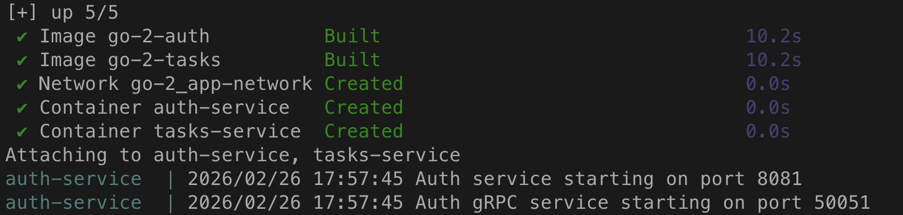
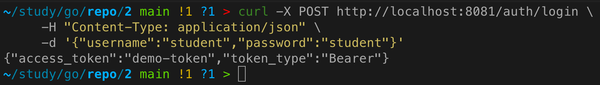
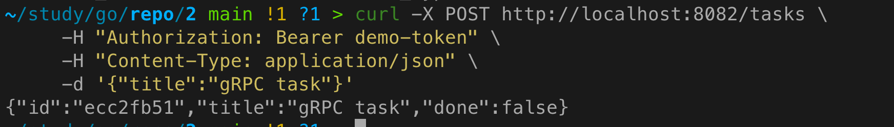
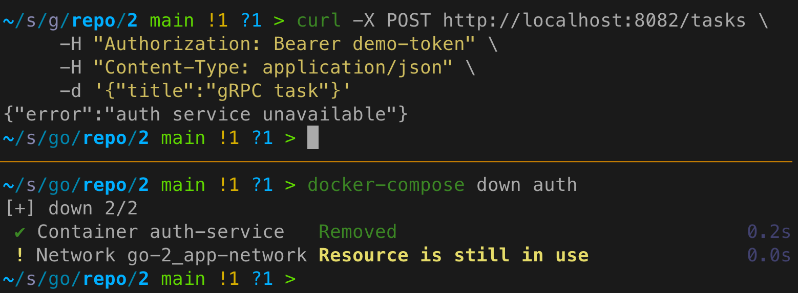

# Практическое задание 2. gRPC: создание простого микросервиса, вызовы методов

**Студент:** Бондарь Андрей Ренатович
**Группа:** ЭФМО-02-25

---

## Цель работы
Заменить HTTP-вызов верификации токена на gRPC, изучив механизмы контрактов (proto), генерацию кода, использование дедлайнов и обработку ошибок.

---

## Контракт (proto)
Файл `proto/auth.proto`:
```protobuf
syntax = "proto3";
package auth;
option go_package = "tech-ip-sem2/shared/api/auth";

service AuthService {
  rpc Verify(VerifyRequest) returns (VerifyResponse);
}

message VerifyRequest {
  string token = 1;
}

message VerifyResponse {
  bool valid = 1;
  string subject = 2;
}
```

---

## Генерация кода
Из корня проекта:
```bash
protoc --go_out=. --go-grpc_out=. proto/auth.proto
```
Сгенерированные файлы: `shared/api/auth/*.pb.go`.

---

## Изменения в сервисах

### Auth (теперь поддерживает gRPC)
- Добавлен gRPC-сервер на порту `50051` (переменная `AUTH_GRPC_PORT`).
- Реализован метод `Verify` в пакете `grpc`.
- HTTP-эндпоинты сохранены для совместимости (опционально).

### Tasks (клиент gRPC)
- При старте создаётся gRPC-подключение к Auth по адресу `AUTH_GRPC_ADDR`.
- В middleware авторизации вызывается `client.Verify` с контекстом, имеющим дедлайн (2 секунды).
- Обработка ошибок:
  - `Unauthenticated` → 401 Unauthorized
  - `DeadlineExceeded` / `Unavailable` → 503 Service Unavailable
  - прочие → 500 Internal Server Error

## Маппинг ошибок gRPC → HTTP
| gRPC код                    | HTTP статус               |
|-----------------------------|---------------------------|
| `Unauthenticated`           | 401 Unauthorized          |
| `DeadlineExceeded`          | 503 Service Unavailable   |
| `Unavailable`               | 503 Service Unavailable   |
| Другие                      | 500 Internal Server Error |

---

## Примеры логов

**Успешный вызов:**
```
[req-123] POST /v1/tasks 201 25ms
[req-123] gRPC call to Auth.Verify succeeded
```

**Auth недоступен:**
```
[req-124] POST /v1/tasks 503 2ms
[req-124] gRPC call failed: auth service unavailable
```

---

## Инструкция по запуску (обновлённая)

### Локально (без Docker)
1. **Auth service** (HTTP + gRPC):
   ```bash
   cd services/auth
   export AUTH_PORT=8081
   export AUTH_GRPC_PORT=50051
   go run ./cmd/auth
   ```
2. **Tasks service** (HTTP + gRPC-клиент):
   ```bash
   cd services/tasks
   export TASKS_PORT=8082
   export AUTH_GRPC_ADDR=localhost:50051
   go run ./cmd/tasks
   ```

### Docker Compose
Файл `docker-compose.yml`:
```yaml
version: '3.8'
services:
  auth:
    build:
      context: .
      dockerfile: services/auth/Dockerfile
    ports:
      - "8081:8081"      # HTTP
      - "50051:50051"    # gRPC
    environment:
      - AUTH_PORT=8081
      - AUTH_GRPC_PORT=50051
    networks:
      - net

  tasks:
    build:
      context: .
      dockerfile: services/tasks/Dockerfile
    ports:
      - "8082:8082"
    environment:
      - TASKS_PORT=8082
      - AUTH_GRPC_ADDR=auth:50051
    depends_on:
      - auth
    networks:
      - net

networks:
  net:
    driver: bridge
```
Запуск:
```bash
docker-compose up --build
```



---

## Проверка работы
1. Получить токен (через HTTP):
   ```bash
   curl -X POST http://localhost:8081/v1/auth/login \
        -H "Content-Type: application/json" \
        -d '{"username":"student","password":"student"}'
   ```



2. Создать задачу (верификация через gRPC):
   ```bash
   curl -X POST http://localhost:8082/v1/tasks \
        -H "Authorization: Bearer demo-token" \
        -H "Content-Type: application/json" \
        -d '{"title":"gRPC task"}'
   ```



3. Остановить Auth и повторить запрос – получить 503.



---

## Выводы
- Успешно заменён HTTP-вызов на gRPC.
- Реализован .proto-контракт, сгенерирован код сервера и клиента.
- В Tasks добавлен вызов с дедлайном (2 сек) и корректной обработкой ошибок.
- Обеспечена обратная совместимость: HTTP-эндпоинты Auth сохранены.
- Документированы команды генерации, маппинг ошибок и примеры логов.

