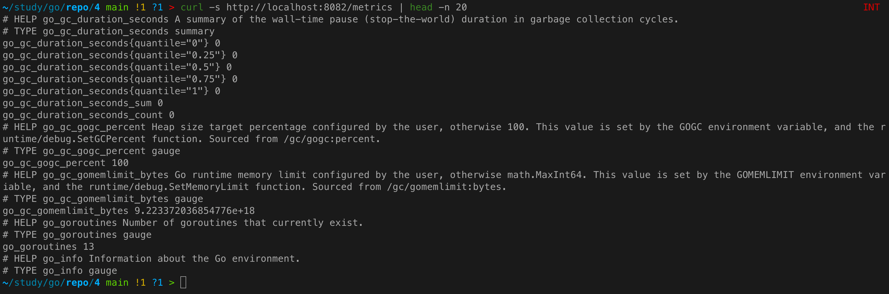
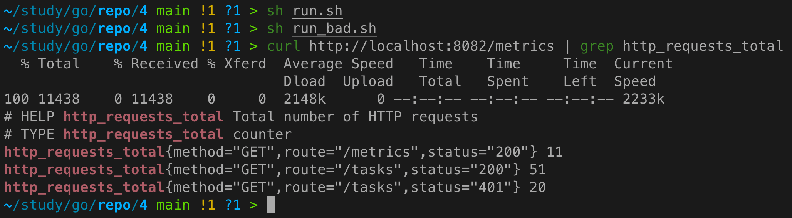
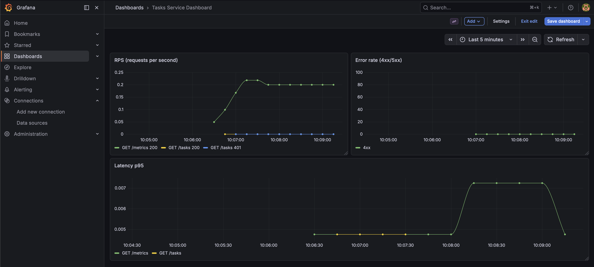

# Практическое задание 4. Настройка Prometheus и Grafana для метрик. Интеграция с приложением

**Студент:** Бондарь Андрей Ренатович  
**Группа:** ЭФМО-02-25

---

## Цель работы
Научиться собирать и визуализировать метрики сервиса: трафик, ошибки, задержки, активные запросы с использованием Prometheus и Grafana.

---

## Добавленные метрики и их labels
В сервис `tasks` добавлены следующие метрики:

| Метрика                        | Тип       | Labels                                     | Описание                          |
|--------------------------------|-----------|--------------------------------------------|-----------------------------------|
| `http_requests_total`          | Counter   | `method`, `route`, `status`                | Общее количество запросов         |
| `http_request_duration_seconds`| Histogram | `method`, `route`                          | Гистограмма длительности запросов |
| `http_in_flight_requests`      | Gauge     | (без labels)                               | Текущее число активных запросов   |

**Примечание:** Для простоты в качестве `route` используется фактический путь запроса. В реальном проекте следует нормализовать пути с параметрами (например, `/tasks/{id}`), но для учебных целей допустимо использовать конкретные пути.

---

## Пример вывода `/metrics`
```bash
$ curl -s http://localhost:8082/metrics | head -n 20
```


---

## Конфигурация Prometheus и Docker Compose

### `deploy/monitoring/docker-compose.monitoring.yml`
```yaml
services:
  prometheus:
    image: prom/prometheus:latest
    container_name: prometheus
    ports:
      - "9090:9090"
    volumes:
      - ./prometheus.yml:/etc/prometheus/prometheus.yml
    networks:
      - app-network   # используем общую сеть

  grafana:
    image: grafana/grafana:latest
    container_name: grafana
    ports:
      - "3000:3000"
    environment:
      - GF_SECURITY_ADMIN_PASSWORD=admin
    networks:
      - app-network
    depends_on:
      - prometheus
```

### `deploy/monitoring/prometheus.yml`
```yaml
global:
  scrape_interval: 5s
  evaluation_interval: 5s

scrape_configs:
  - job_name: 'tasks'
    static_configs:
      - targets: ['tasks:8082']
    metrics_path: /metrics
```

**Объяснение:**  
- Prometheus настроен на сбор метрик каждые 5 секунд с эндпоинта `/metrics` сервиса `tasks`.
- Так как `tasks` тоже запущен в Docker Compose, достаточно указать имя сервиса (`tasks:8082`) и общей сети.

---

## Графики в Grafana (описание и PromQL запросы)

В Grafana создан дашборд с тремя панелями:

### RPS (запросы в секунду)
**Запрос:**
```promql
rate(http_requests_total[1m])
```
**Описание:** Показывает среднюю частоту запросов за последнюю минуту по всем методам и статусам. Можно разбить по `status` или `method` для детализации.

### Ошибки (4xx и 5xx)
**Запрос для 4xx:**
```promql
rate(http_requests_total{status=~"4.."}[1m])
```
**Запрос для 5xx:**
```promql
rate(http_requests_total{status=~"5.."}[1m])
```
**Описание:** Позволяет отслеживать количество клиентских и серверных ошибок в реальном времени.

### Латенти p95 (95-й перцентиль)
**Запрос:**
```promql
histogram_quantile(0.95, sum(rate(http_request_duration_seconds_bucket[1m])) by (le, method, route))
```
**Описание:** Показывает значение, ниже которого лежит 95% длительности запросов. Это даёт реалистичную картину задержек, в отличие от среднего.

*Скриншоты графиков приложены отдельно в папке `img/` (например, `grafana_rps.png`, `grafana_errors.png`, `grafana_latency.png`).*

---

## Инструкция по запуску всей связки

### Локальный запуск (без Docker)
1. Убедиться, что установлен Go 1.21+.
2. Запустить сервисы и стек мониторинга:
   ```bash
   cd deploy/
   docker-compose up -d
   ```

### Генерация тестовой нагрузки
```bash
# Успешные запросы
for i in {1..50}; do curl -s -o /dev/null -H "Authorization: Bearer demo-token" http://localhost:8082/tasks; done

# Запросы с неверным токеном (ошибки 401)
for i in {1..20}; do curl -s -o /dev/null -H "Authorization: Bearer wrong" http://localhost:8082/tasks; done
```

### Проверка метрик
```bash
curl http://localhost:8082/metrics | grep http_requests_total
```



### Доступ к Grafana
- URL: http://localhost:3000
- Логин/пароль: admin/admin
- Добавить источник данных Prometheus: URL = `http://prometheus:9090` (так как оба сервиса в одной сети Docker)
- Создать дашборд с указанными выше запросами.



---

## Вывод
В ходе работы в сервис `tasks` добавлены метрики Prometheus, настроен сбор метрик с помощью Prometheus и визуализация в Grafana. Построены ключевые графики для анализа производительности. Таким образом, цель практического занятия достигнута.

