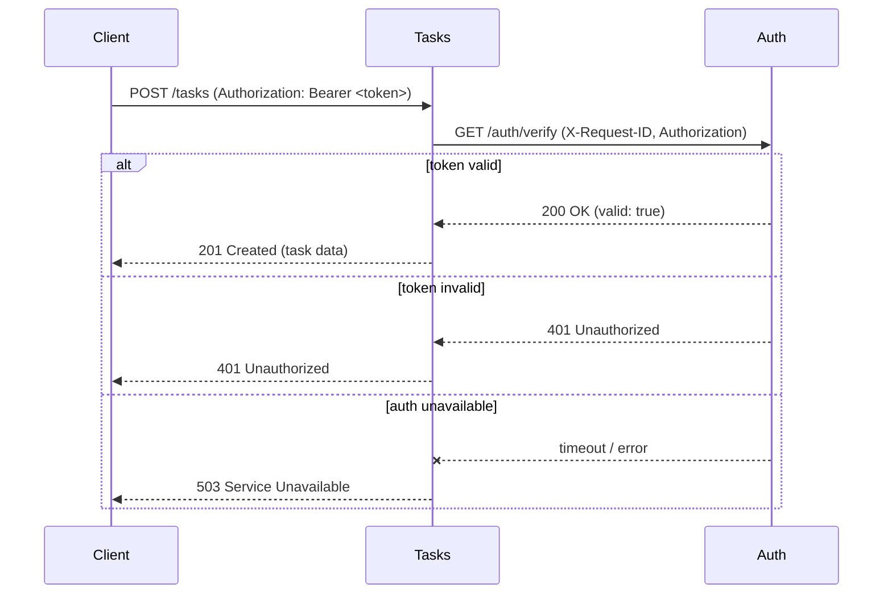
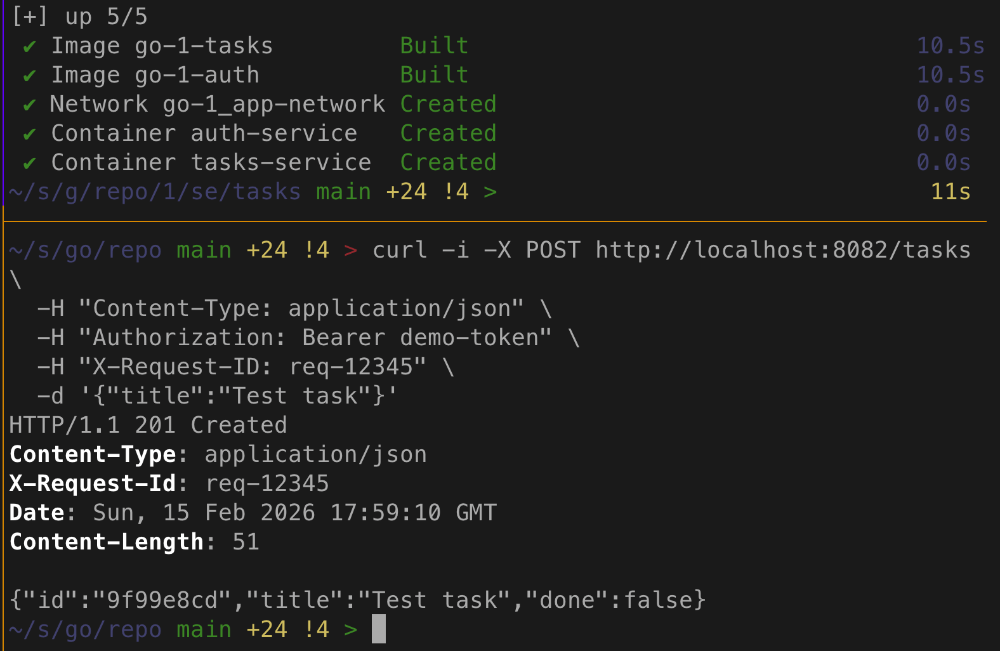
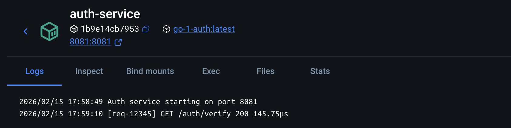
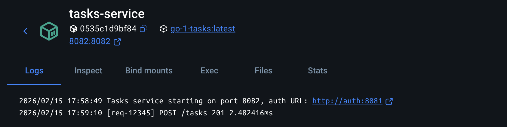
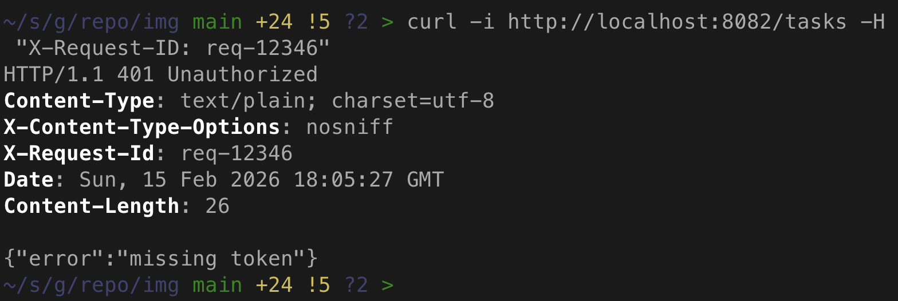
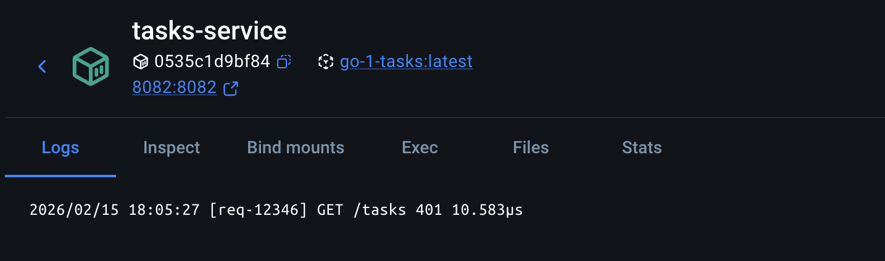

# Практическое задание 1. Разделение монолита на 2 микросервиса. Взаимодействие через HTTP

**Студент:** Бондарь Андрей Ренатович
**Группа:** ЭФМО-02-25

---

## Цель работы
Научиться декомпозировать монолитное приложение на два микросервиса (Auth и Tasks), организовать их синхронное взаимодействие по HTTP с использованием таймаутов, проброса request-id и базового логирования.

---

## Границы ответственности сервисов

- **Auth service** – отвечает за выдачу и проверку токенов доступа. В учебной реализации используется фиксированный токен `demo-token`. Сервис предоставляет два эндпоинта: логин (получение токена) и верификацию (проверка токена).
- **Tasks service** – управляет задачами (CRUD). Хранит задачи в памяти (in-memory). Все операции, кроме создания самого сервиса, требуют наличия валидного токена. Проверка токена выполняется синхронным вызовом к Auth service с пробросом request-id и соблюдением таймаута.

---

## Схема взаимодействия (Mermaid)



---

## Список эндпоинтов

### Auth service (порт 8081)

| Метод | Путь              | Описание                          | Заголовки               |
|-------|-------------------|-----------------------------------|-------------------------|
| POST  | `/auth/login`  | Получение токена                  | –                       |
| GET   | `/auth/verify` | Проверка токена                   | `Authorization: Bearer` |

### Tasks service (порт 8082)

| Метод  | Путь               | Описание                | Заголовки               |
|--------|--------------------|-------------------------|-------------------------|
| POST   | `/tasks`        | Создать задачу          | `Authorization: Bearer` |
| GET    | `/tasks`        | Список задач            | `Authorization: Bearer` |
| GET    | `/tasks/{id}`   | Получить задачу по ID   | `Authorization: Bearer` |
| PATCH  | `/tasks/{id}`   | Обновить задачу         | `Authorization: Bearer` |
| DELETE | `/tasks/{id}`   | Удалить задачу          | `Authorization: Bearer` |

---

## Подтверждение проброса request-id (логи)

При выполнении запросов через curl с заголовком `X-Request-ID` в логах обоих сервисов отображается соответствующий идентификатор, что позволяет отследить цепочку вызовов.

### Пример выполнения

**Запрос на создание задачи с токеном и request-id:**
```bash
curl -i -X POST http://localhost:8082/tasks \
  -H "Content-Type: application/json" \
  -H "Authorization: Bearer demo-token" \
  -H "X-Request-ID: req-12345" \
  -d '{"title":"Test task"}'
```







**Запрос без токена:**
```bash
curl -i http://localhost:8082/tasks -H "X-Request-ID: req-12346"
```






Как видно из логов, request-id пробрасывается из Tasks в Auth и фиксируется в обоих сервисах, что упрощает диагностику.

---

## Инструкция по запуску

### Локальный запуск (без Docker)

1. Убедиться, что установлен Go 1.20+.
2. Запустить Auth service:
   ```bash
   cd services/auth
   export AUTH_PORT=8081
   go run ./cmd/auth
   ```
3. Запустить Tasks service:
   ```bash
   cd services/tasks
   export TASKS_PORT=8082
   export AUTH_BASE_URL=http://localhost:8081
   go run ./cmd/tasks
   ```

### Запуск через Docker Compose

```bash
docker-compose up --build
```

Сервисы будут доступны на `localhost:8081` (auth) и `localhost:8082` (tasks).

---

## Выводы

В ходе работы были достигнуты следующие результаты:

- Чётко разделены зоны ответственности между сервисами.
- Реализованы HTTP-эндпоинты в соответствии с заданными контрактами.
- Организован межсервисный вызов с таймаутом (3 секунды) и корректной обработкой ошибок (401, 503).
- Реализован проброс request-id через заголовки, что позволяет трассировать запросы в логах.
- Написана документация API и инструкция по запуску.

Таким образом, цель практического занятия достигнута, полученные навыки могут быть применены при проектировании более сложных микросервисных систем.
