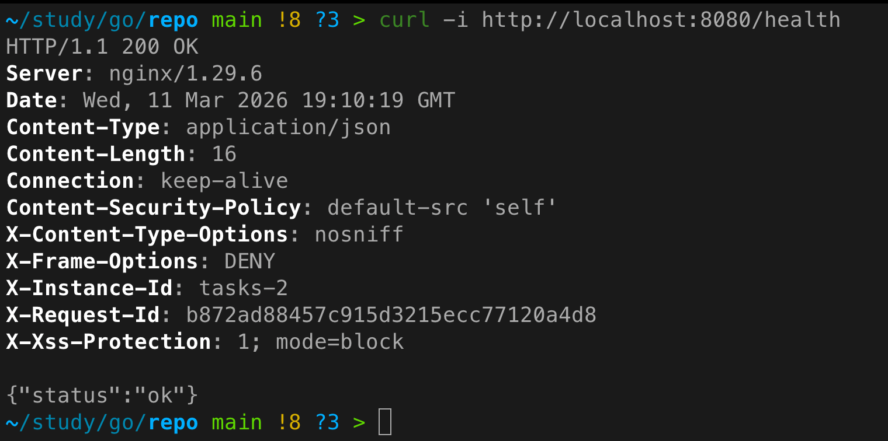
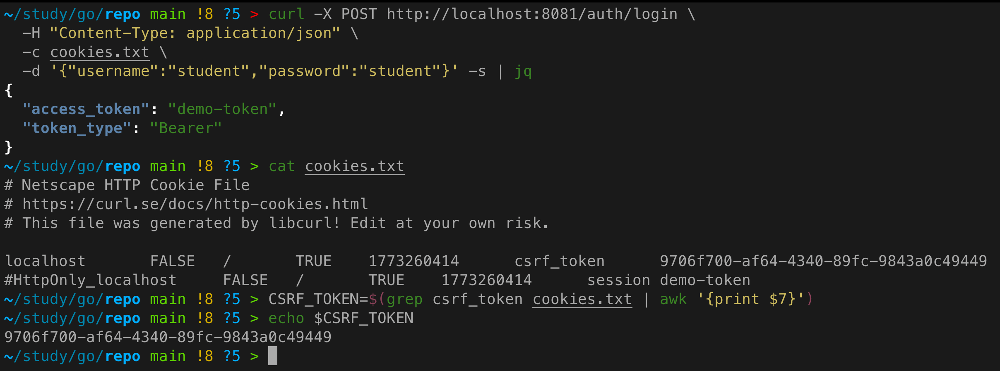
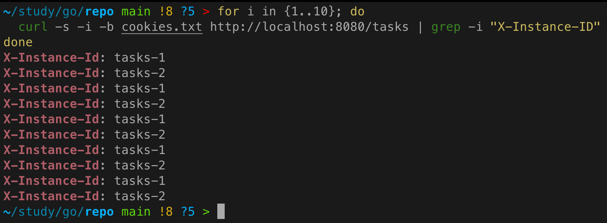
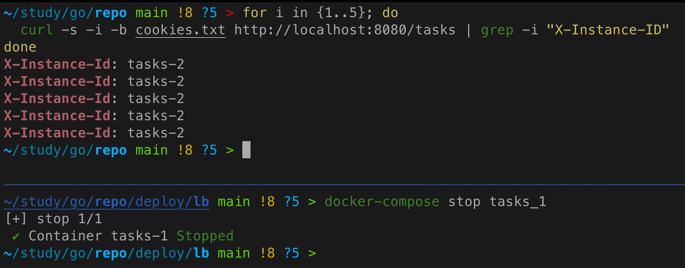

# Практическое задание 10. Горизонтальное масштабирование: использование Load Balancer (NGINX)

**Студент:** Бондарь Андрей Ренатович  
**Группа:** ЭФМО-02-25

---

## Цель работы
Запустить несколько экземпляров одного сервиса и распределить трафик через NGINX, убедившись, что запросы реально распределяются и система устойчиво работает при падении одной реплики.

---

## Запущенные реплики сервиса `tasks`

Для демонстрации горизонтального масштабирования запущены **две реплики** сервиса `tasks`:

- `tasks_1` с идентификатором инстанса `tasks-1`
- `tasks_2` с идентификатором инстанса `tasks-2`

Обе реплики используют общие внешние ресурсы:
- PostgreSQL как единое хранилище данных
- Redis как общий кэш
- Auth service для аутентификации

Каждая реплика получает переменную окружения `INSTANCE_ID`, которая добавляется в HTTP-ответ в виде заголовка `X-Instance-ID`. Это позволяет отследить, какой именно инстанс обработал запрос.

---

## Конфигурация NGINX (ключевые фрагменты)

NGINX выступает в роли балансировщика нагрузки. Он слушает порт `8080` и распределяет входящие запросы между двумя репликами `tasks`.

**Файл конфигурации:** `deploy/lb/nginx.conf`

```nginx
events {}

http {
    upstream tasks_backend {
        server tasks_1:8082;
        server tasks_2:8082;
    }

    server {
        listen 8080;

        location / {
            proxy_pass http://tasks_backend;
            proxy_set_header Host $host;
            proxy_set_header X-Real-IP $remote_addr;
            proxy_set_header X-Forwarded-For $proxy_add_x_forwarded_for;
            proxy_set_header X-Forwarded-Proto $scheme;
            proxy_set_header X-Request-ID $http_x_request_id;
            proxy_set_header Authorization $http_authorization;
        }

        location /health {
            proxy_pass http://tasks_backend/health;
            proxy_set_header Host $host;
        }
    }
}
```

**Пояснения:**
- `upstream tasks_backend` – список серверов, между которыми балансируется нагрузка (алгоритм round-robin по умолчанию).
- В `location /` проксируются все запросы к API, при этом сохраняются важные заголовки (Authorization, X-Request-ID).
- Отдельный `location /health` направляется к эндпоинту проверки здоровья.

---

## Health endpoint

В сервис `tasks` добавлен эндпоинт `GET /health`, который возвращает `200 OK` с JSON-объектом:

```json
{
  "status": "ok"
}
```

Этот эндпоинт не требует аутентификации и используется для проверки готовности инстанса принимать трафик.

**Пример проверки через балансировщик:**
```bash
curl -i http://localhost:8080/health
```



---

## Получение cookies (логин)

Для аутентификации необходимо сначала получить сессионные cookies от сервиса `auth`.
В стенде `deploy/lb` сервис `auth` не опубликован наружу по умолчанию, поэтому добавим в `docker-compose.yml` проброс порта:

```yaml
auth:
  # ... остальные настройки
  ports:
    - "8081:8081"
```

После этого выполняем логин:
```bash
curl -X POST http://localhost:8081/auth/login \
  -H "Content-Type: application/json" \
  -c cookies.txt \
  -d '{"username":"student","password":"student"}'
```

В результате создаётся файл `cookies.txt` с двумя cookies: `session` и `csrf_token`.



## Демонстрация распределения запросов

Теперь выполним цикл запросов к `GET /tasks` через балансировщик, передавая сохранённые cookies. Для вывода заголовка `X-Instance-ID` используем `-i` и `grep`:

```bash
for i in {1..10}; do
  curl -s -i -b cookies.txt http://localhost:8080/tasks | grep -i "X-Instance-ID"
done
```

**Ожидаемый вывод:**
```
X-Instance-ID: tasks-1
X-Instance-ID: tasks-2
X-Instance-ID: tasks-1
X-Instance-ID: tasks-2
...
```
Заголовки чередуются, подтверждая, что запросы распределяются между двумя репликами.

Если нужно также видеть HTTP-статус, можно использовать более сложный скрипт, но для демонстрации балансировки достаточно заголовка.



---

## Демонстрация отказоустойчивости

Остановим одну из реплик (например, `tasks_1`):
```bash
docker-compose stop tasks_1
```

Повторим цикл запросов:
```bash
for i in {1..5}; do
  curl -s -i -b cookies.txt http://localhost:8080/tasks | grep -i "X-Instance-ID"
done
```

**Результат:**
```
X-Instance-ID: tasks-2
X-Instance-ID: tasks-2
X-Instance-ID: tasks-2
X-Instance-ID: tasks-2
X-Instance-ID: tasks-2
```
Все запросы успешно обработаны оставшейся репликой. Балансировщик автоматически исключил недоступный инстанс из ротации.



## Инструкция по запуску стенда

1. Перейти в директорию с конфигурацией балансировщика:
   ```bash
   cd deploy/lb
   ```

2. Запустить все сервисы:
   ```bash
   docker-compose up -d --build
   ```

3. Проверить состояние контейнеров:
   ```bash
   docker-compose ps
   ```

4. Выполнить проверочные запросы (как описано выше).

---

## Выводы
- Реализован стенд с двумя репликами сервиса `tasks` и балансировщиком NGINX.
- Добавлен health endpoint и идентификация инстанса через заголовок `X-Instance-ID`.
- Продемонстрировано равномерное распределение запросов и корректная работа при отказе одной реплики.
- Сервис остаётся stateless за счёт использования общей БД и Redis.

