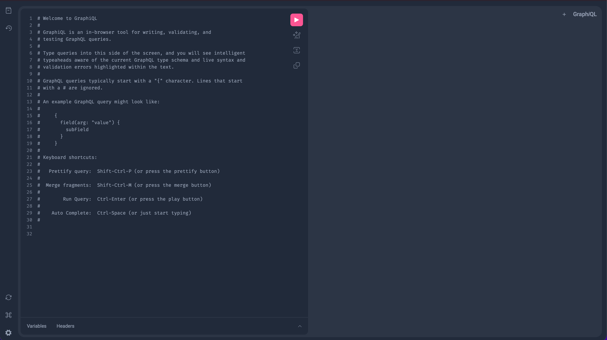

# Практическое задание 10. Горизонтальное масштабирование: использование Load Balancer (NGINX)

**Студент:** Бондарь Андрей Ренатович  
**Группа:** ЭФМО-02-25

---

## Цель работы
Научиться проектировать GraphQL-схему, генерировать серверный каркас gqlgen и реализовывать резолверы для запросов (Query) и изменений (Mutation).

---

## Схема GraphQL (контракт)

**Файл:** `services/graphql/graph/schema.graphqls`

```graphql
type Task {
  id: ID!
  title: String!
  description: String
  done: Boolean!
  dueDate: String
  createdAt: String!
  updatedAt: String!
}

input CreateTaskInput {
  title: String!
  description: String
  dueDate: String
}

input UpdateTaskInput {
  title: String
  description: String
  done: Boolean
  dueDate: String
}

type Query {
  tasks: [Task!]!
  task(id: ID!): Task
}

type Mutation {
  createTask(input: CreateTaskInput!): Task!
  updateTask(id: ID!, input: UpdateTaskInput!): Task!
  deleteTask(id: ID!): Boolean!
}
```

**Пояснение:**
- `Task` — основной тип, представляющий задачу.
- `CreateTaskInput` и `UpdateTaskInput` — входные типы для мутаций.
- `Query` содержит два запроса: получение списка задач и получение задачи по ID.
- `Mutation` включает создание, обновление и удаление задачи.

Схема является контрактом между клиентом и сервером: клиент может запрашивать только те поля, которые описаны, а сервер обязан их предоставить.

---

## Реализация резолверов

Резолверы находятся в пакете `internal/resolvers`. Основные компоненты:

- **`Resolver`** — структура, хранящая зависимость от репозитория (доступ к БД).
- **`QueryResolver`** — реализует методы `Tasks` и `Task`.
- **`MutationResolver`** — реализует методы `CreateTask`, `UpdateTask`, `DeleteTask`.

Пример резолвера `Tasks`:

```go
func (r *QueryResolver) Tasks(ctx context.Context) ([]*models.Task, error) {
    tasks, err := r.Repo.GetAll()
    if err != nil {
        return nil, err
    }
    result := make([]*models.Task, len(tasks))
    for i := range tasks {
        result[i] = &tasks[i]
    }
    return result, nil
}
```

Резолверы используют общий репозиторий `PostgresRepo`, который работает с PostgreSQL. Таким образом, данные хранятся в той же БД, что и в сервисе `tasks`, обеспечивая консистентность.

---

## Авторизация

GraphQL-сервис поддерживает авторизацию через middleware, которое проверяет заголовок `Authorization: Bearer <token>`.

- Токен передаётся в gRPC-сервис `auth` для верификации.
- В middleware создаётся контекст с информацией о пользователе (в учебной версии просто флаг).
- Если токен невалиден или отсутствует, запрос может быть отклонён (в учебных целях разрешены анонимные запросы, но можно легко включить обязательную проверку).

Для защиты мутаций можно добавить проверку наличия пользователя в контексте непосредственно в резолверах.

---

## Примеры GraphQL-запросов (для Playground)

### Получить список задач
```graphql
query {
  tasks {
    id
    title
    done
  }
}
```

### Получить задачу по ID
```graphql
query GetTask($id: ID!) {
  task(id: $id) {
    id
    title
    description
    done
    dueDate
  }
}
```
**Переменные:**
```json
{
  "id": "t_001"
}
```

### Создать задачу
```graphql
mutation Create($input: CreateTaskInput!) {
  createTask(input: $input) {
    id
    title
    done
  }
}
```
**Переменные:**
```json
{
  "input": {
    "title": "GraphQL task",
    "description": "created via mutation"
  }
}
```

### Обновить задачу
```graphql
mutation Update($id: ID!, $input: UpdateTaskInput!) {
  updateTask(id: $id, input: $input) {
    id
    title
    done
  }
}
```
**Переменные:**
```json
{
  "id": "t_001",
  "input": {
    "done": true
  }
}
```

### Удалить задачу
```graphql
mutation Delete($id: ID!) {
  deleteTask(id: $id)
}
```
**Переменные:**
```json
{
  "id": "t_001"
}
```

---

## Инструкция по запуску

### Переменные окружения
Сервис `graphql` использует следующие переменные:

| Переменная       | Значение по умолчанию | Описание                          |
|------------------|------------------------|-----------------------------------|
| `GRAPHQL_PORT`   | 8090                   | Порт HTTP-сервера                 |
| `AUTH_GRPC_ADDR` | auth:50051             | Адрес gRPC-сервиса auth           |
| `DB_HOST`        | postgres               | Хост PostgreSQL                   |
| `DB_PORT`        | 5432                   | Порт PostgreSQL                   |
| `DB_USER`        | tasks_user             | Пользователь БД                   |
| `DB_PASSWORD`    | tasks_pass             | Пароль БД                         |
| `DB_NAME`        | tasks_db               | Имя БД                            |

### Запуск через docker-compose
Убедитесь, что в корневом `deploy/docker-compose.yml` добавлен сервис `graphql` (как описано в файлах к занятию). Затем:

```bash
cd deploy
docker-compose up -d --build
```

### Доступ к Playground
Откройте браузер и перейдите по адресу: [http://localhost:8090/](http://localhost:8090/)  
Появится GraphQL Playground, где можно выполнять запросы.



---

## Выводы
- Создан отдельный GraphQL-сервис с использованием gqlgen.
- Описана схема с типами, запросами и мутациями.
- Реализованы резолверы, использующие общий репозиторий PostgreSQL.
- Добавлена опциональная авторизация через Auth service.
- Сервис запускается в общем docker-compose и доступен через Playground.

