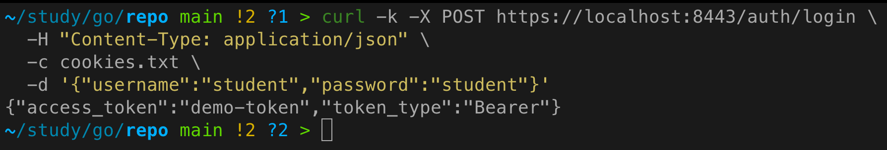
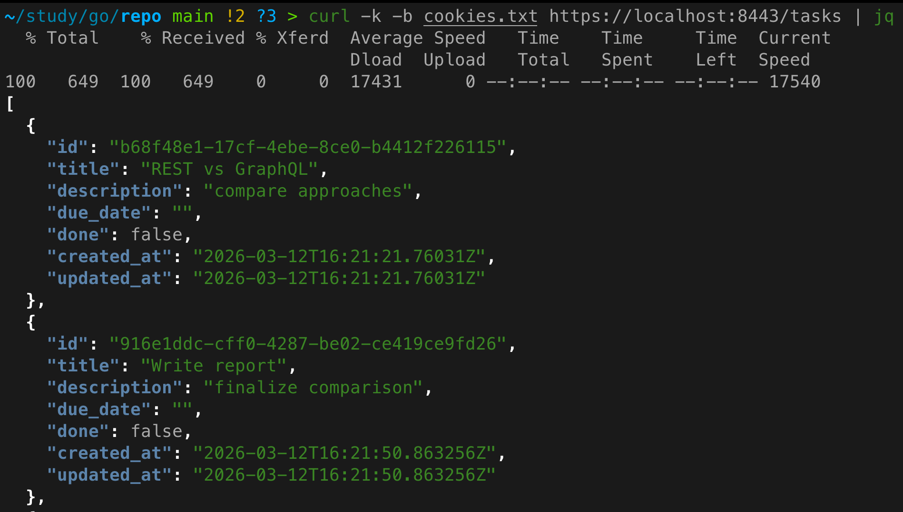
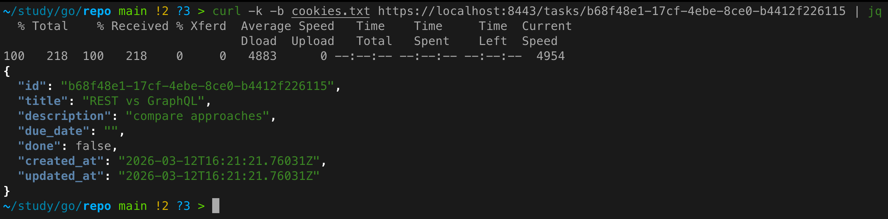
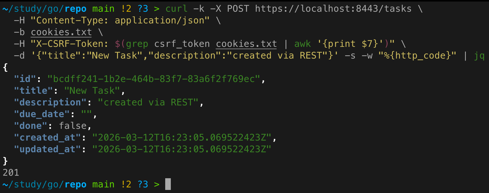
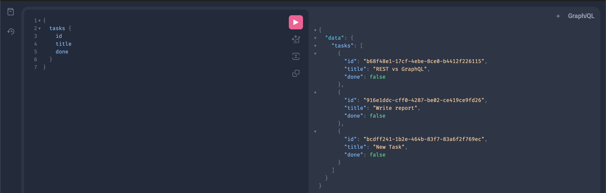
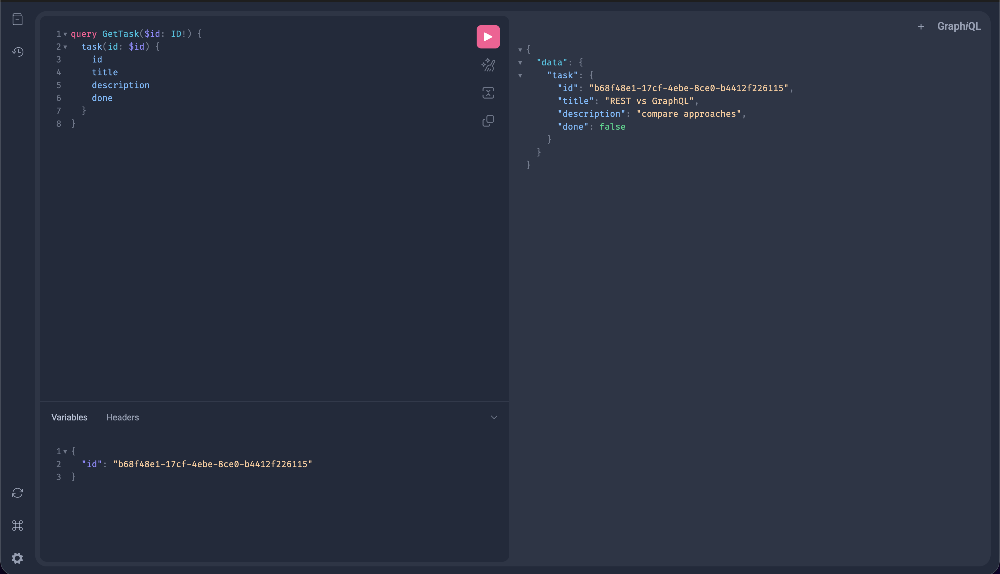
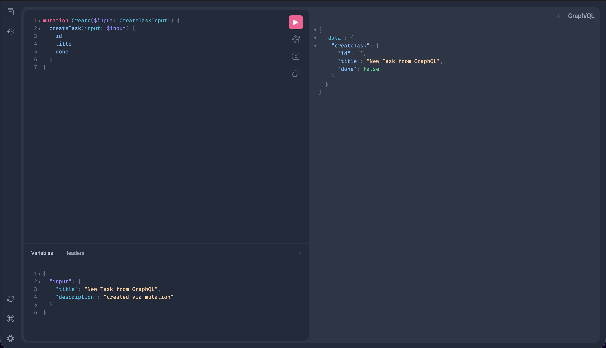

# Практическое задание 12. Сравнение REST и GraphQL: разработка одного и того же функционала двумя способами

**Студент:** Бондарь Андрей Ренатович  
**Группа:** ЭФМО-02-25

---

## Цель работы
Сравнить REST и GraphQL на практике: реализовать один и тот же бизнес-сценарий двумя способами, проанализировать количество запросов, объём данных, обработку ошибок и особенности кэширования, чтобы понять сильные и слабые стороны каждого подхода.

---

## Выбранный UI-сценарий

В качестве типового клиентского сценария взят экран со списком задач и детальной карточкой задачи, а также действие создания новой задачи.

**Требования к данным:**

| Экран         | Необходимые поля                                    |
|---------------|-----------------------------------------------------|
| Список задач  | `id`, `title`, `done`                               |
| Детали задачи | `id`, `title`, `description`, `done`                |
| Создание      | передать `title`, `description` (опционально)       |

Этот сценарий покрывает основные операции чтения и записи и позволяет продемонстрировать over-fetching/under-fetching.

---

## Предварительная настройка (общая для обоих подходов)

Все запросы к сервисам выполняются через HTTPS (NGINX на порту 8443).  
Для аутентификации используется **session cookie**, которая выдается сервисом `auth` после логина.

### Получение cookies (логин)
```bash
curl -k -X POST https://localhost:8443/auth/login \
  -H "Content-Type: application/json" \
  -c cookies.txt \
  -d '{"username":"student","password":"student"}'
```



Файл `cookies.txt` будет содержать `session` и `csrf_token`.  
**Важно:** все последующие запросы должны использовать этот файл (`-b cookies.txt`).

---

## Реализация сценария через REST

REST API реализовано в сервисе `tasks` (доступен через тот же балансировщик).

### Получение списка задач
**Запрос:**
```bash
curl -k -b cookies.txt https://localhost:8443/tasks
```



**Проблема:** Клиент получает все поля, хотя для списка нужны только `id`, `title`, `done`. Это **over-fetching** (избыточные данные).

### Получение деталей задачи
**Запрос:**
```bash
curl -k -b cookies.txt https://localhost:8443/tasks/t_001
```



Здесь все поля нужны, за исключением, возможно, `due_date`, но в целом ответ соответствует требованиям.

### Создание новой задачи
**Запрос:**
```bash
curl -k -X POST https://localhost:8443/tasks \
  -H "Content-Type: application/json" \
  -b cookies.txt \
  -H "X-CSRF-Token: $(grep csrf_token cookies.txt | awk '{print $7}')" \
  -d '{"title":"New Task","description":"created via REST"}'
```



### Итого для REST

- Для отображения списка и детали требуется **2 запроса**.
- Объём ответа: список ~650 байт (с лишними полями), деталь ~220 байт.
- При создании возвращается полный объект, что может быть избыточно, если клиенту нужен только `id`.

---

## Реализация сценария через GraphQL

GraphQL API реализовано в отдельном сервисе `graphql` (порт 8090, доступен через Playground по `/`). Для авторизации также используется session cookie.

### Получение списка задач (только нужные поля)



**Преимущество:** только запрошенные поля, без лишних данных.

### Получение деталей задачи



### Создание новой задачи



Клиент получает только те поля, которые указал в запросе.

### Итог для GraphQL
- Для сценария требуется **2 запроса** – столько же, сколько в REST.
- Объём ответа: список ~350 байт, деталь ~140 байт (без лишних полей).
- При создании возвращается минимум данных.


---

## Сравнение по критериям

### Количество запросов
| REST                         | GraphQL                      |
|------------------------------|------------------------------|
| 2 запроса (список + деталь)  | 2 запроса (список + деталь)  |

Оба подхода требуют одинакового числа запросов для данного сценария. Однако если бы клиенту понадобились данные из нескольких ресурсов (например, задачи и комментарии к ним), в REST потребовалось бы несколько запросов, а в GraphQL можно обойтись одним.

### Объём данных
| REST                         | GraphQL                      |
|------------------------------|------------------------------|
| Список: ≈ 650 байт (с лишними полями) | Список: ≈ 350 байт (только нужные) |
| Деталь: ≈ 220 байт (все поля)        | Деталь: ≈ 140 байт (только нужные) |
| **Итого:** 870 байт          | **Итого:** 490 байт          |

GraphQL позволяет существенно сократить объём передаваемых данных за счёт точной выборки полей. В REST возможна некоторая оптимизация (например, параметр `?fields=id,title,done`), но это не стандарт и требует дополнительной реализации.

### Ошибки и статусы
| REST                         | GraphQL                      |
|------------------------------|------------------------------|
| HTTP статус (200, 404, 400, 500) + JSON с описанием | Всегда HTTP 200, ошибки в поле `errors` массива |
| Пример ошибки (неверный токен):<br>`HTTP/1.1 401 Unauthorized`<br>`{"error":"unauthorized"}` | Пример:<br>`HTTP/1.1 200 OK`<br>`{"errors":[{"message":"unauthorized"}],"data":null}` |

**Вывод:** В REST проще мониторить ошибки на уровне HTTP (статусы, логи балансировщика). В GraphQL все ответы имеют статус 200, поэтому для обнаружения проблем клиент обязан партить тело ответа. Однако структура ошибок в GraphQL стандартизирована и может содержать больше деталей.

### Кэширование
| REST                         | GraphQL                      |
|------------------------------|------------------------------|
| Кэширование на уровне HTTP (URL как ключ) легко поддерживается прокси и браузерами | Единый endpoint /query, сложно кэшировать по URL; требуется кэширование на уровне данных (например, persisted queries, кэш в Redis) или использование `@cacheControl` директив |

**Вывод:** REST даёт более простое и эффективное кэширование на инфраструктурном уровне. GraphQL требует дополнительных усилий для организации кэширования (например, Apollo Client на клиенте или кэширование резолверов).

---

## Итоговый вывод

**Когда REST удобнее:**
- Если нужна простота кэширования и стандартная HTTP-семантика.
- При работе с общедоступными API, где важна кэшируемость (например, CDN).
- Когда клиент — браузер и хочется использовать встроенный HTTP-кэш.
- При необходимости простого мониторинга по HTTP-статусам.

**Когда GraphQL оправдан:**
- Когда клиентское приложение требует гибкости в запросе данных (разные экраны, мобильные устройства с ограниченным трафиком).
- При необходимости объединить несколько ресурсов в одном запросе (under-fetching).
- Когда нужно точно контролировать объём передаваемых данных (over-fetching).
- При разработке сложных интерфейсов с частыми изменениями требований к данным.

В данном учебном проекте оба подхода реализованы и работают с общей базой данных. GraphQL показал преимущество в точности выборки и экономии трафика, тогда как REST остаётся более простым в реализации и мониторинге. Выбор зависит от конкретных требований приложения.

---

## Заключение
В ходе работы проведено практическое сравнение REST и GraphQL на одном и том же функционале. Выявлены преимущества и недостатки каждого подхода. Полученные навыки позволяют осознанно выбирать архитектуру API в зависимости от требований проекта.

