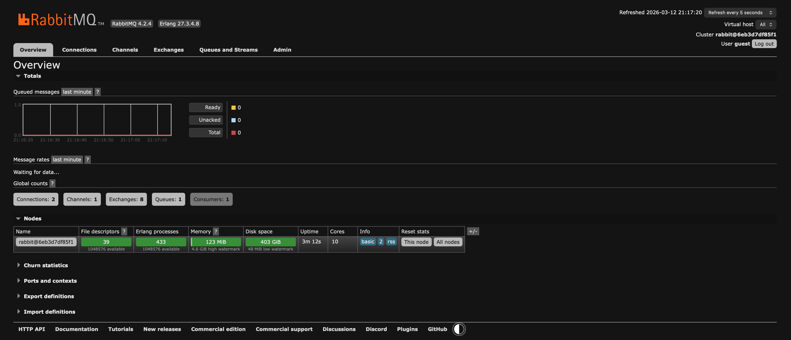
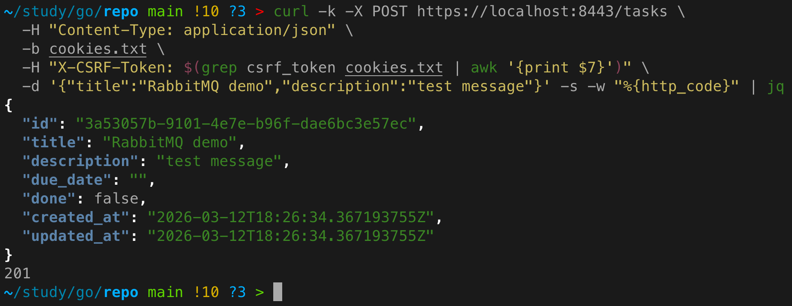
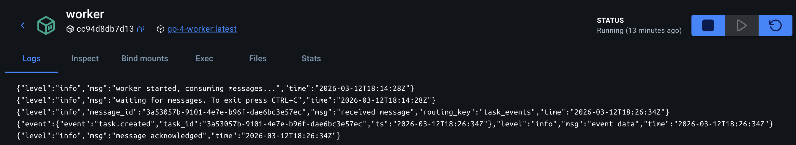
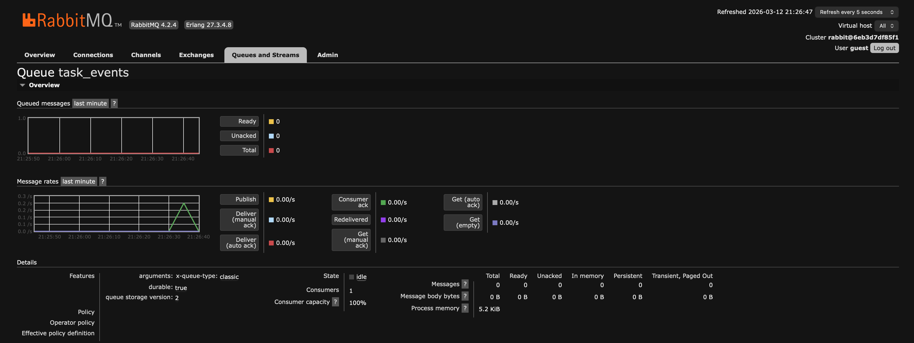

# Практическое задание 13. Подключение к RabbitMQ. Отправка и получение сообщений

**Студент:** Бондарь Андрей Ренатович  
**Группа:** ЭФМО-02-25

---

## Цель работы
Научиться поднимать RabbitMQ, публиковать сообщения в очередь и обрабатывать их потребителем с подтверждением (ack), понимая основы надёжности доставки.

---

## Запуск RabbitMQ

Для работы с RabbitMQ используется Docker-контейнер с management-плагином.

**Файл:** `deploy/docker-compose.yml`

```yaml
services:
  # ...
  rabbitmq:
    image: rabbitmq:4-management-alpine
    container_name: rabbitmq
    ports:
      - "5672:5672"   # AMQP
      - "15672:15672" # Management UI
    environment:
      RABBITMQ_DEFAULT_USER: guest
      RABBITMQ_DEFAULT_PASS: guest
    volumes:
      - rabbitmq_data:/var/lib/rabbitmq
    healthcheck:
      test: ["CMD", "rabbitmq-diagnostics", "check_port_connectivity"]
      interval: 30s
      timeout: 10s
      retries: 5
    networks:
      - app-network

volumes:
  rabbitmq_data:
```

Запуск:
```bash
cd deploy/rabbit
docker-compose up -d
```

После запуска доступны:
- AMQP-порт `5672` для приложений
- веб-интерфейс управления на `http://localhost:15672` (логин/пароль: guest/guest)



---

## Формат сообщения

Сообщение публикуется в формате JSON и содержит минимальную информацию о событии:

```json
{
  "event": "task.created",
  "task_id": "t_001",
  "ts": "2026-03-12T12:00:00Z"
}
```

Поле `event` позволяет различать типы событий (в будущем можно добавить `task.updated`, `task.deleted`).  
Поле `ts` содержит временную метку события в UTC.

Сообщение публикуется с параметром `persistent` (`DeliveryMode: amqp.Persistent`), чтобы оно сохранялось на диске при падении брокера.

---

## Producer: публикация события в сервисе `tasks`

В сервисе `tasks` после успешного создания задачи (записи в БД) публикуется событие в очередь `task_events`.

**Место публикации:** в хендлере `Create` после вызова `repo.Create(task)`. Публикация происходит асинхронно (в отдельной горутине), чтобы не задерживать ответ клиенту.

**Режим обработки ошибок:** выбран подход **best effort**:
- Если RabbitMQ недоступен при старте, соединение не устанавливается, и публикация не происходит (логируется предупреждение).
- При ошибке публикации (например, очередь не существует) ошибка логируется, но клиенту возвращается успешный ответ (задача создана).

**Код публикации (фрагмент):**

```go
func (h *TaskHandler) publishTaskCreatedEvent(taskID string) {
    ch, _ := h.rabbitConn.Channel()
    defer ch.Close()

    // объявление очереди (если не существует)
    ch.QueueDeclare(h.queueName, true, false, false, false, nil)

    event := map[string]interface{}{
        "event":   "task.created",
        "task_id": taskID,
        "ts":      time.Now().UTC().Format(time.RFC3339),
    }
    body, _ := json.Marshal(event)

    msg := amqp.Publishing{
        ContentType:  "application/json",
        Body:         body,
        DeliveryMode: amqp.Persistent,
        MessageId:    taskID,
    }
    ch.Publish("", h.queueName, true, false, msg)
}
```

---

## Consumer: отдельный сервис `worker`

Для обработки сообщений создан отдельный микросервис `worker`. Он подключается к RabbitMQ, объявляет очередь и начинает потреблять сообщения с ручным подтверждением (ack).

**Основные параметры:**
- **Durable очередь** – сохраняется после перезапуска брокера.
- **Prefetch count = 1** – worker получает не более одного сообщения одновременно, что гарантирует последовательную обработку и предотвращает перегрузку.
- **Ручной ack** – сообщение подтверждается только после успешной обработки (в данном случае после логирования).

**Логика обработки:**
1. Получить сообщение.
2. Распарсить JSON.
3. Записать в лог содержимое события.
4. Отправить ack.

Если сообщение невалидно (например, не JSON), оно отправляется в dead letter (nack без requeue). В учебной версии это просто логируется и отбрасывается.

**Фрагмент consumer.go:**

```go
msgs, _ := c.channel.Consume(c.queue, "", false, false, false, false, nil)

for msg := range msgs {
    var event map[string]interface{}
    if err := json.Unmarshal(msg.Body, &event); err != nil {
        c.log.WithError(err).Error("invalid message")
        msg.Nack(false, false) // не возвращать в очередь
        continue
    }
    c.log.WithField("event", event).Info("event received")
    msg.Ack(false) // подтверждение обработки
}
```

---

## Демонстрация работы

### Запуск всех компонентов
```bash
cd deploy
docker-compose up -d --build
```

Проверка, что все контейнеры запущены:
```bash
docker-compose ps
```

### Создание задачи через REST API
```bash
curl -k -X POST https://localhost:8443/tasks \
  -H "Content-Type: application/json" \
  -b cookies.txt \
  -H "X-CSRF-Token: $(grep csrf_token cookies.txt | awk '{print $7}')" \
  -d '{"title":"RabbitMQ demo","description":"test message"}'
```



### Логи worker'а
В логах контейнера `worker` должно появиться сообщение о полученном событии.



### Проверка через веб-интерфейс RabbitMQ

Открыть http://localhost:15672, войти как guest/guest. Перейти в раздел Queues -> task_events.
Видно количество сообщений (0, если все обработаны) и графики.



---

## Выводы
- RabbitMQ успешно развёрнут в Docker, очередь объявлена как durable.
- Сервис `tasks` публикует события после создания задачи (best effort).
- Сервис `worker` потребляет сообщения с ручным подтверждением и prefetch=1.
- Продемонстрирована базовая работа с очередями: публикация, потребление, подтверждение.

