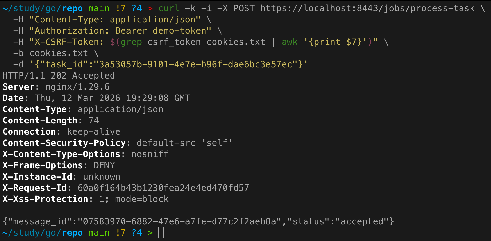
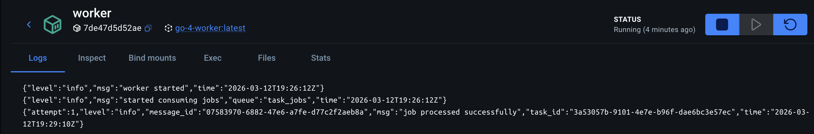
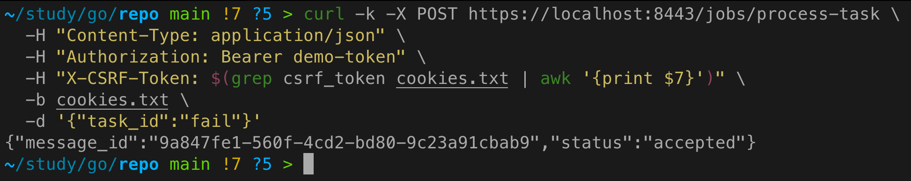
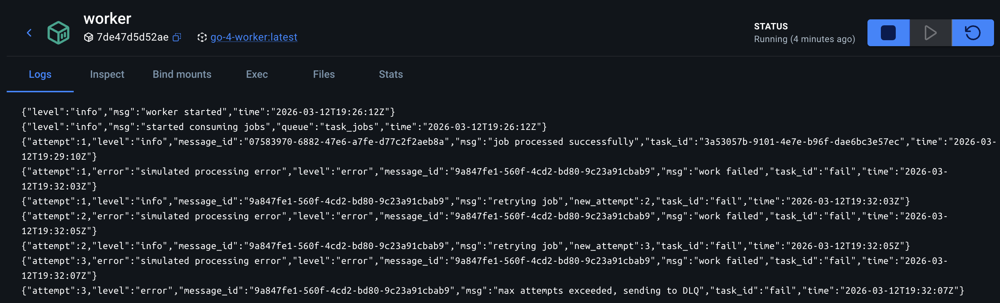
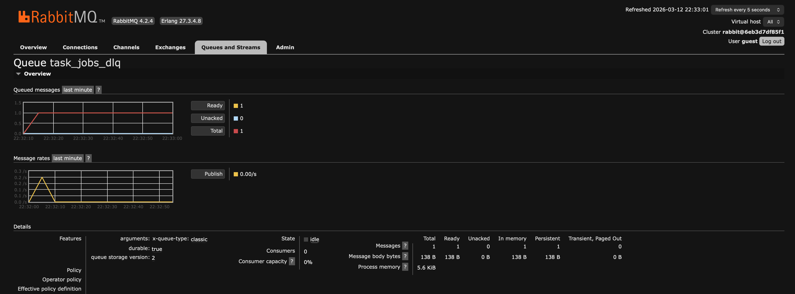

# Практическое задание 14. Реализация очереди задач (producer–consumer): retries, DLQ, идемпотентность

**Студент:** Бондарь Андрей Ренатович  
**Группа:** ЭФМО-02-25

---

## Цель работы
Построить рабочую очередь задач, которая устойчиво обрабатывает ошибки: временные ошибки ретраятся, "плохие" сообщения уходят в DLQ, а обработчик устойчив к дублям (идемпотентен).

---

## Используемые очереди и их настройка

В RabbitMQ созданы две очереди:

| Очередь          | Тип      | Durable | Назначение                                  |
|------------------|----------|---------|---------------------------------------------|
| `task_jobs`      | Основная | true    | Принимает задачи на обработку               |
| `task_jobs_dlq`  | DLQ      | true    | Накопление сообщений, превысивших число попыток |

Обе очереди объявлены как durable, чтобы сохраняться при перезапуске брокера. DLQ не имеет специальных привязок – сообщения попадают в неё принудительно из кода consumer'а при превышении попыток.

---

## Формат сообщения задачи (job)

Сообщение представляет собой JSON со следующими полями:

```json
{
  "job": "process_task",
  "task_id": "t_001",
  "attempt": 1,
  "message_id": "550e8400-e29b-41d4-a716-446655440000",
  "timestamp": "2026-03-12T12:00:00Z"
}
```

- `job` – тип задачи (позволяет расширять систему на разные виды работ).
- `task_id` – идентификатор задачи, которую нужно обработать.
- `attempt` – номер попытки (начинается с 1).
- `message_id` – уникальный идентификатор сообщения (UUID), используется для идемпотентности.
- `timestamp` – время создания сообщения.

---

## Producer: постановка задачи

В сервисе `tasks` добавлен новый эндпоинт:

`POST /jobs/process-task`

**Пример запроса:**
```bash
curl -k -i -X POST https://localhost:8443/jobs/process-task \
  -H "Content-Type: application/json" \
  -H "Authorization: Bearer demo-token" \
  -H "X-CSRF-Token: $(grep csrf_token cookies.txt | awk '{print $7}')" \
  -b cookies.txt \
  -d '{"task_id":"t_001"}'
```



При получении запроса сервис генерирует `message_id`, формирует сообщение и публикует его в очередь `task_jobs`. Публикация происходит с параметром `delivery_mode = persistent` для гарантии сохранности при падении брокера.

Если RabbitMQ недоступен, запрос завершается ошибкой `500 Internal Server Error` (в учебной версии можно допустить graceful degradation, но здесь выбрано жёсткое требование наличия очереди).

---

## Consumer: обработка с ретраями и DLQ

Consumer реализован в отдельном сервисе `worker`. Он подключается к RabbitMQ, объявляет очереди и начинает потреблять сообщения из `task_jobs` с `prefetch=1`.

### Идемпотентность
Перед выполнением задачи consumer проверяет, не обрабатывалось ли уже сообщение с таким `message_id`. Для хранения обработанных ID используется in‑memory store с TTL (5 минут). Это гарантирует, что повторная доставка (например, из-за сбоя после выполнения, но до ack) не приведёт к повторной обработке.

### Выполнение работы
Работа имитируется задержкой `time.Sleep(2 * time.Second)`. Для демонстрации ошибок: если `task_id` содержит подстроку `"fail"`, генерируется ошибка.

### Retry policy
При ошибке обработки:
- Увеличивается счётчик `attempt` в новом сообщении.
- Если `attempt <= max_attempts (3)`, новое сообщение публикуется в ту же очередь `task_jobs`.
- Исходное сообщение подтверждается (`ack`), чтобы оно не висело в очереди.
- Если `attempt > max_attempts`, сообщение отправляется в DLQ (`task_jobs_dlq`) с заголовком `dlq-reason`, и исходное сообщение также подтверждается.

Ретраи происходят мгновенно (без задержки) – это упрощённый вариант, но достаточный для демонстрации.

### Логирование
Каждое событие логируется в JSON-формате с полями `message_id`, `task_id`, `attempt`, что позволяет отслеживать путь сообщения.

---

## Демонстрация работы

### Успешная обработка
```bash
curl -X POST https://localhost:8443/jobs/process-task \
  -H "Content-Type: application/json" \
  -H "Authorization: Bearer demo-token" \
  -H "X-CSRF-Token: $CSRF_TOKEN" \
  -b cookies.txt \
  -d '{"task_id":"t_001"}'
```


Лог worker:


### Обработка с ошибкой и ретраями
```bash
curl -X POST https://localhost:8443/jobs/process-task \
  -d '{"task_id":"fail"}'
```



Логи worker:



### Сообщение в DLQ
В веб-интерфейсе RabbitMQ (http://localhost:15672) в очереди `task_jobs_dlq` появится одно сообщение. Можно просмотреть его содержимое и заголовки.



---

## Инструкция по запуску

### Предварительные требования
- Docker и Docker Compose
- Установленный Go (для локального запуска, необязательно)

### Запуск всех сервисов
```bash
cd deploy
docker-compose up -d --build
```

### Проверка
- Убедиться, что RabbitMQ доступен по адресу `http://localhost:15672` (логин/пароль: guest/guest).
- Выполнить тестовые запросы из раздела 6.
- Наблюдать логи worker:
  ```bash
  docker-compose logs -f worker
  ```

---

## Выводы
- Реализована очередь задач с ограниченным числом повторных попыток (max_attempts=3).
- При превышении попыток сообщения направляются в DLQ для последующего анализа.
- Добавлена идемпотентность на основе `message_id` (in-memory store с TTL).
- Система устойчива к временным сбоям и гарантирует обработку «хотя бы один раз» с защитой от дублей.

