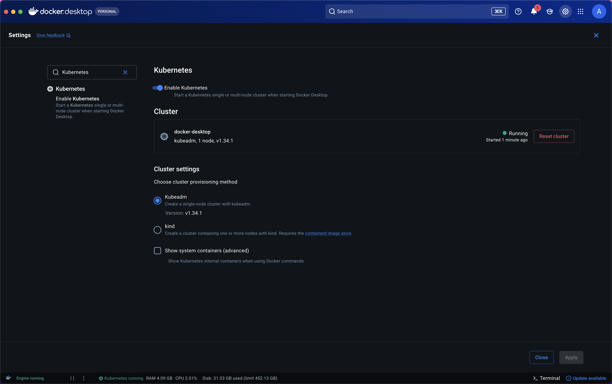
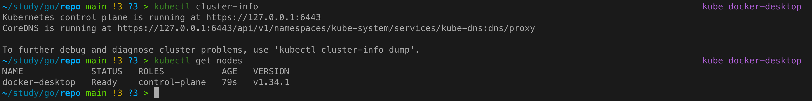
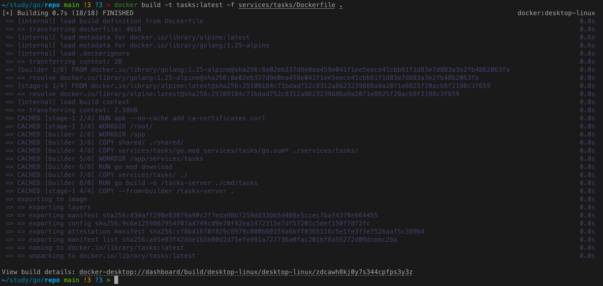
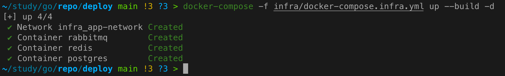
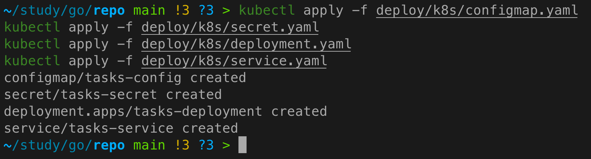
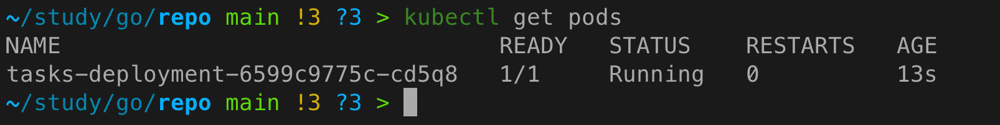
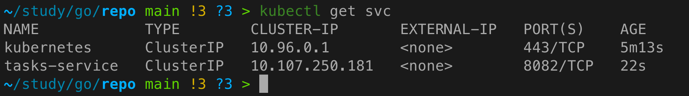
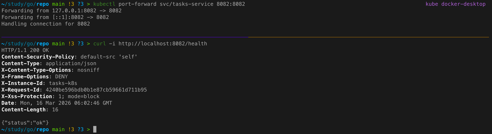

# Практическое задание 16. Публикация приложения в Kubernetes (минимальный манифест)

**Студент:** Бондарь Андрей Ренатович  
**Группа:** ЭФМО-02-25

---

## Цель работы
Научиться публиковать сервис в Kubernetes: описывать Deployment и Service, передавать конфигурацию через ConfigMap, добавлять readiness/liveness проверки.

---

## Используемый Kubernetes стенд

Для начала убедимся в наличии Kubernetes.
Откроем Docker Desktop, перейдем в Settings -> Kubernetes
и убедимся, что галочка Enable Kubernetes стоит.



Проверка подключения:
```bash
kubectl cluster-info
kubectl get nodes
```



---

## Подготовка Docker-образа
Образ для сервиса `tasks` был собран локально и загружен в кластер.

### Сборка образа
```bash
docker build -t tasks:latest -f services/tasks/Dockerfile .
```



### Загрузка образа в кластер (для Docker Desktop)
В Docker Desktop образы доступны автоматически, так как демон Docker общий. Для Minikube потребовалось бы выполнить:
```bash
minikube image load tasks:latest
```

---

## Манифесты Kubernetes

Все манифесты расположены в директории `deploy/k8s/`.

### ConfigMap – несекретные параметры

**Файл:** `configmap.yaml`

```yaml
apiVersion: v1
kind: ConfigMap
metadata:
  name: tasks-config
data:
  TASKS_PORT: "8082"
  # Для доступа к сервисам, запущенным через docker-compose на хосте, используем host.docker.internal
  AUTH_GRPC_ADDR: "host.docker.internal:50051"
  DB_HOST: "host.docker.internal"
  DB_PORT: "5432"
  DB_USER: "tasks_user"
  DB_NAME: "tasks_db"
  REDIS_ADDR: "host.docker.internal:6379"
  CACHE_TTL_SECONDS: "120"
  CACHE_TTL_JITTER_SECONDS: "30"
  LOG_LEVEL: "info"
  INSTANCE_ID: "tasks-k8s"
```

**Пояснение:**  
Использование `host.docker.internal` позволяет подам Kubernetes обращаться к сервисам, запущенным на хосте (через docker-compose), что удобно для быстрой демонстрации. В production-сценарии зависимости также разворачиваются в кластере.
Работает только для Docker Desktop, в Linux можно задать IP напрямую.

### Secret – конфиденциальные данные

**Файл:** `secret.yaml`

```yaml
apiVersion: v1
kind: Secret
metadata:
  name: tasks-secret
type: Opaque
stringData:
  DB_PASSWORD: "tasks_pass"
```

Пароль хранится в Secret и не светится в открытом виде.

### Deployment – описание пода

**Файл:** `deployment.yaml`

```yaml
apiVersion: apps/v1
kind: Deployment
metadata:
  name: tasks-deployment
spec:
  replicas: 1
  selector:
    matchLabels:
      app: tasks
  template:
    metadata:
      labels:
        app: tasks
    spec:
      containers:
      - name: tasks
        image: tasks:latest
        imagePullPolicy: IfNotPresent
        ports:
        - containerPort: 8082
        envFrom:
        - configMapRef:
            name: tasks-config
        - secretRef:
            name: tasks-secret
        env:
        - name: DB_PASSWORD
          valueFrom:
            secretKeyRef:
              name: tasks-secret
              key: DB_PASSWORD
        livenessProbe:
          httpGet:
            path: /health
            port: 8082
          initialDelaySeconds: 10
          periodSeconds: 5
        readinessProbe:
          httpGet:
            path: /health
            port: 8082
          initialDelaySeconds: 5
          periodSeconds: 5
        resources:
          requests:
            memory: "64Mi"
            cpu: "100m"
          limits:
            memory: "128Mi"
            cpu: "200m"
```

**Ключевые параметры:**
- `imagePullPolicy: IfNotPresent` – не качать образ из registry, если он уже есть локально.
- `livenessProbe` – проверка, что сервис жив (перезапуск при падении).
- `readinessProbe` – проверка готовности принимать трафик (пока не пройдёт – под не получает запросы).

### Service – доступ к подам

**Файл:** `service.yaml`

```yaml
apiVersion: v1
kind: Service
metadata:
  name: tasks-service
spec:
  selector:
    app: tasks
  ports:
  - protocol: TCP
    port: 8082
    targetPort: 8082
  type: ClusterIP
```

Сервис типа ClusterIP доступен только внутри кластера. Для внешнего доступа используется `port-forward`.

---

## Применение манифестов и проверка

### Поднимем инфраструктуры в docker-compose
```bash
cd deploy/
docker-compose -f infra/docker-compose.infra.yml up --build -d
```



### Применение
```bash
kubectl apply -f deploy/k8s/configmap.yaml
kubectl apply -f deploy/k8s/secret.yaml
kubectl apply -f deploy/k8s/deployment.yaml
kubectl apply -f deploy/k8s/service.yaml
```



### Проверка подов
```bash
kubectl get pods
```



### Проверка сервиса
```bash
kubectl get svc
```



### Доступ через port-forward
```bash
kubectl port-forward svc/tasks-service 8082:8082
```
В другом терминале:
```bash
curl -i http://localhost:8082/health
```



---

## Выводы
- Сервис `tasks` успешно развёрнут в Kubernetes с помощью Deployment и Service.
- Конфигурация вынесена в ConfigMap и Secret, что соответствует лучшим практикам.
- Добавлены readiness и liveness пробы для обеспечения надёжности.
- Доступ к сервису продемонстрирован через port-forward и curl.

