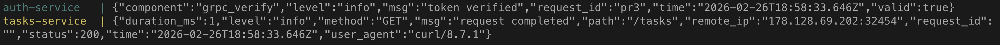
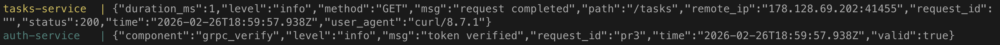
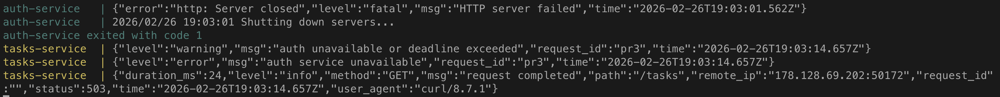
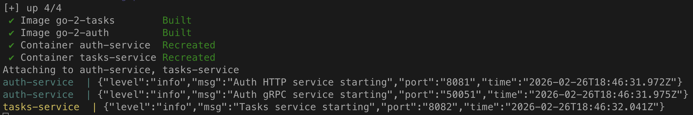

# Практическое задание 3. Логирование с помощью logrus или zap. Ведение

**Студент:** Бондарь Андрей Ренатович
**Группа:** ЭФМО-02-25

## Цель работы
Научиться внедрять структурированные логи в микросервисы на Go с использованием logrus, настроить единый формат логов, прокидывание request-id и корректное логирование ошибок без раскрытия чувствительных данных.

---

## Выбор логгера: logrus
В проекте использован **logrus** по следующим причинам:
- Простота интеграции и настройки;
- Готовый JSON-форматтер;
- Поддержка уровней логирования и полей (структурированные логи);
- Широкая распространённость в учебных и промышленных проектах.

---

## Единый стандарт полей логов
Все логи в сервисах Auth и Tasks содержат следующие поля:

| Поле          | Описание                                   | Пример                 |
|---------------|--------------------------------------------|------------------------|
| `service`     | Имя сервиса (auth / tasks)                 | `"auth"`               |
| `request_id`  | UUID или значение из заголовка X-Request-ID| `"pr3"`                |
| `method`      | HTTP метод                                 | `"GET"`                |
| `path`        | Путь запроса                               | `"/tasks"`             |
| `status`      | Код ответа                                 | `200`                  |
| `duration_ms` | Время обработки в миллисекундах            | `15`                   |
| `remote_ip`   | IP клиента                                 | `"127.0.0.1:12345"`    |
| `user_agent`  | User-Agent                                 | `"curl/7.68.0"`        |
| `level`       | Уровень (info, warn, error)                | `"info"`               |
| `msg`         | Текстовое сообщение                        | `"request completed"`  |

Для ошибок дополнительно:
- `error` – текст ошибки (без секретов)
- `component` – компонент, где возникла ошибка (например, `"auth_client"`)

---

## Реализованные механизмы

### Middleware request-id
- Извлекает `X-Request-ID` из заголовка или генерирует новый (UUID).
- Сохраняет request-id в контекст и добавляет в ответ.

### Middleware accesslog
- Логирует каждый завершённый HTTP-запрос с указанными выше полями.
- Измеряет длительность обработки.

### Прокидывание request-id в gRPC
- В Tasks клиент добавляет `x-request-id` в метаданные исходящего gRPC-вызова.
- В Auth сервер извлекает request-id из метаданных и использует в логах.

### Безопасность логирования
- Токены и пароли **никогда не пишутся** в логи (логируется только факт наличия токена).
- Внутренние ошибки (БД, сеть) логируются подробно на сервере, клиенту возвращается общее сообщение.

---

## Примеры логов и команды curl для их получения

### Успешный запрос к Tasks (получение списка задач)
**Команда:**
```bash
curl -i http://localhost:8082/tasks \
     -H "Authorization: Bearer demo-token" \
     -H "X-Request-ID: pr3"
```



---

### Ошибка авторизации (невалидный токен)
**Команда:**
```bash
curl -i http://localhost:8082/tasks \
     -H "Authorization: Bearer demo-token" \
     -H "X-Request-ID: pr3"
```



---

### Недоступность Auth сервиса
**Команда:**
```bash
# Останавливаем Auth, затем выполняем запрос
curl -i http://localhost:8082/tasks \
     -H "Authorization: Bearer demo-token" \
     -H "X-Request-ID: pr3"
```



---

## Инструкция по запуску и проверке

### Локальный запуск (без Docker)
1. Установите Go 1.21+.
2. Клонируйте репозиторий.
3. Запустите Auth:
   ```bash
   cd services/auth
   export AUTH_PORT=8081
   export AUTH_GRPC_PORT=50051
   go run ./cmd/auth
   ```
4. Запустите Tasks:
   ```bash
   cd services/tasks
   export TASKS_PORT=8082
   export AUTH_GRPC_ADDR=localhost:50051
   go run ./cmd/tasks
   ```

### Запуск через Docker Compose
```bash
docker-compose up --build
```



### Проверка логирования
Выполните команды из раздела 5 и наблюдайте логи в консоли каждого сервиса. Убедитесь, что request-id одинаков в обоих сервисах.

---

## Выводы
- Внедрено структурированное логирование с logrus в формате JSON.
- Реализованы middleware для request-id и accesslog.
- Настроено прокидывание request-id в межсервисные gRPC-вызовы.
- Обеспечена безопасность логирования (пароли/токены не пишутся).
- Подготовлены примеры логов для различных сценариев.

