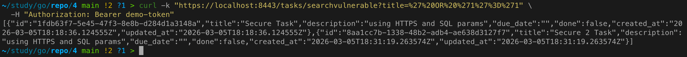
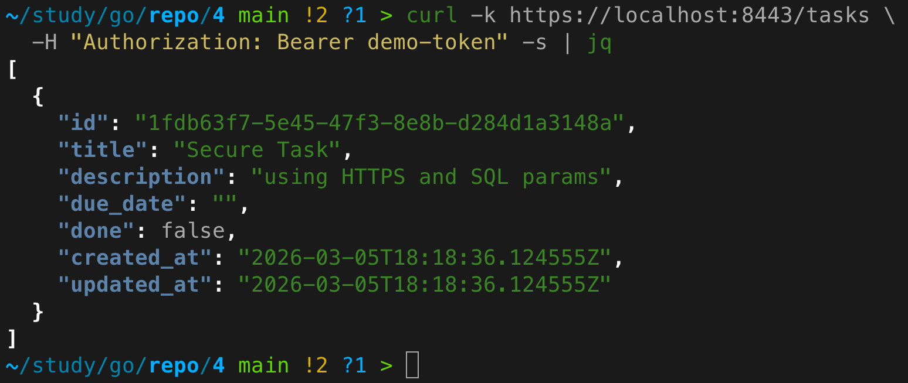
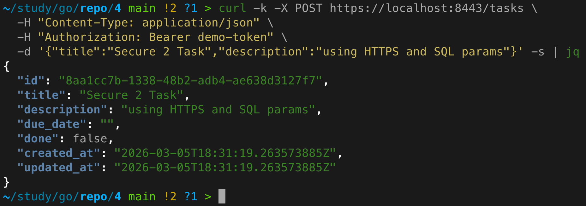

# Практическое задание 5. Реализация HTTPS (TLS-сертификаты). Защита от SQL-инъекций

**Студент:** Бондарь Андрей Ренатович  
**Группа:** ЭФМО-02-25

---

## Цель работы
Научиться включать защищённый транспорт (HTTPS) и устранять уязвимости SQL-инъекций, используя корректные методы работы с базой данных.

---

## Выбор варианта TLS
Для реализации HTTPS был выбран **вариант с NGINX как TLS-терминатором**:
- Приложение (сервис `tasks`) остаётся HTTP и слушает порт 8082.
- NGINX принимает HTTPS на порту 8443, расшифровывает трафик и проксирует его в `tasks`.
- Такой подход ближе к индустриальным стандартам, упрощает управление сертификатами и позволяет при необходимости легко менять сертификаты без перезапуска приложения.

---

## Генерация самоподписанного сертификата
Сертификат и ключ сгенерированы в директории `deploy/tls/` с помощью команды:
```bash
mkdir -p deploy/tls
openssl req -x509 -newkey rsa:2048 -nodes \
  -keyout deploy/tls/key.pem \
  -out deploy/tls/cert.pem \
  -days 365 \
  -subj "/CN=localhost"
```
Созданные файлы:
- `cert.pem` – публичный сертификат,
- `key.pem` – приватный ключ (добавлен в `.gitignore`).

---

## Конфигурация NGINX
Файл `deploy/nginx.conf` (скопирован из `deploy/tls/nginx.conf`):
```nginx
events {}

http {
    server {
        listen 8443 ssl;
        server_name localhost;

        ssl_certificate /etc/nginx/tls/cert.pem;
        ssl_certificate_key /etc/nginx/tls/key.pem;

        location / {
            proxy_pass http://tasks:8082;
            proxy_set_header Host $host;
            proxy_set_header X-Forwarded-Proto https;
            proxy_set_header X-Request-ID $http_x_request_id;
            proxy_set_header Authorization $http_authorization;
        }
    }
}
```

---

## Интеграция базы данных PostgreSQL

### Добавление сервиса в docker-compose
В корневой `deploy/docker-compose.yml` добавлен сервис `postgres`:
```yaml
postgres:
  image: postgres:15
  container_name: postgres
  environment:
    POSTGRES_USER: tasks_user
    POSTGRES_PASSWORD: tasks_pass
    POSTGRES_DB: tasks_db
  volumes:
    - postgres_data:/var/lib/postgresql/data
    - ../migrations:/docker-entrypoint-initdb.d
  networks:
    - app-network
```
Также обновлён сервис `tasks` – добавлены переменные окружения для подключения к БД и зависимость от `postgres`.

### Миграция
Создан файл `migrations/01_create_tasks_table.sql`:
```sql
CREATE TABLE IF NOT EXISTS tasks (
    id          TEXT PRIMARY KEY,
    title       TEXT NOT NULL,
    description TEXT,
    done        BOOLEAN DEFAULT FALSE,
    due_date    DATE,
    created_at  TIMESTAMP DEFAULT NOW(),
    updated_at  TIMESTAMP DEFAULT NOW()
);
```
При старте контейнера PostgreSQL скрипт выполняется автоматически.

### Реализация репозитория
Создан пакет `repository` с интерфейсом `TaskRepository` и реализацией `PostgresRepo`. Все запросы к БД используют **параметризованные выражения** (плейсхолдеры `$1`), что исключает возможность SQL-инъекций.

Пример безопасного метода поиска:
```go
func (r *PostgresRepo) SearchByTitle(title string) ([]service.Task, error) {
    rows, err := r.db.Query(`SELECT ... FROM tasks WHERE title = $1`, title)
    // ...
}
```

Для демонстрации уязвимости дополнительно реализован метод `SearchByTitleVulnerable`, использующий конкатенацию строк.

---

## Демонстрация SQL-инъекции

### Уязвимый запрос (до исправления)
Временно в хендлере `Search` используется вызов `repo.SearchByTitleVulnerable`.  
Выполним поиск с параметром, внедряющим всегда истинное условие:
```bash
curl -k "https://localhost:8443/tasks/searchvulnerable?title=%27%20OR%20%271%27%3D%271"
```



### Исправленный вариант
После замены на безопасный метод `SearchByTitle` тот же запрос не возвращает ни одной задачи (если нет задачи с названием, точно равным введённой строке). Параметризованный запрос обрабатывает ввод как данные, а не как код SQL.

---

## Обработка ошибок БД
Все ошибки базы данных логируются на сервере с использованием `logrus`. Клиенту возвращается общее сообщение:
```json
{"error":"internal error"}
```
Пример логирования ошибки:
```json
{
  "level": "error",
  "msg": "failed to create task",
  "error": "pq: duplicate key value violates unique constraint",
  "component": "repository",
  "time": "2026-03-05T10:00:00Z"
}
```

---

## Инструкция по запуску всего стенда

### Предварительные требования
- Docker и Docker Compose
- Установленный Go 1.21+ (для локального запуска, необязательно)

### Запуск сервисов
```bash
cd deploy
docker-compose up -d
```

### Проверка работы HTTPS
```bash
curl -k https://localhost:8443/tasks \
  -H "Authorization: Bearer demo-token"
```



### Создание задачи через HTTPS
```bash
curl -k -X POST https://localhost:8443/tasks \
  -H "Content-Type: application/json" \
  -H "Authorization: Bearer demo-token" \
  -d '{"title":"Secure Task","description":"using HTTPS and SQL params"}'
```



### Проверка SQL-инъекции (после исправления)
```bash
curl -k "https://localhost:8443/tasks/search?title=%27%20OR%20%271%27%3D%271"
```


---

## Выводы
- Настроен HTTPS через NGINX с самоподписанным сертификатом.
- Сервис `tasks` переведён на хранение данных в PostgreSQL.
- Реализован слой репозитория с параметризованными запросами, полностью исключающими SQL-инъекции.
- Для учебных целей продемонстрирована уязвимость и её исправление.
- Все ошибки БД логируются без раскрытия деталей клиенту.

