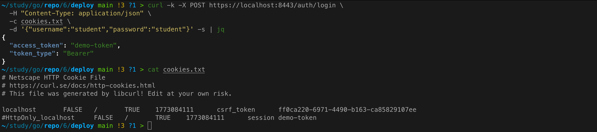
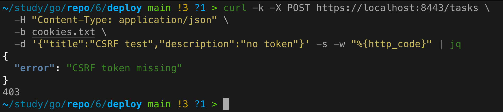
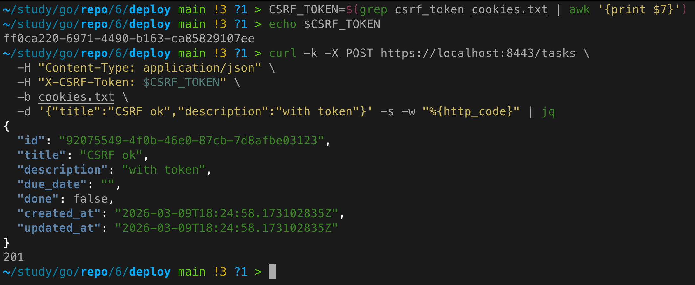
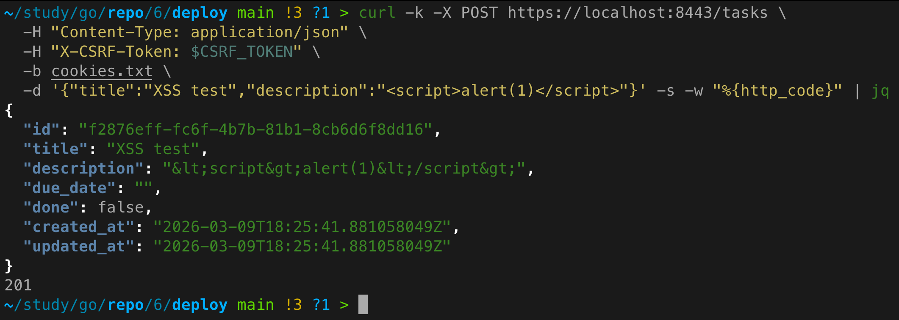
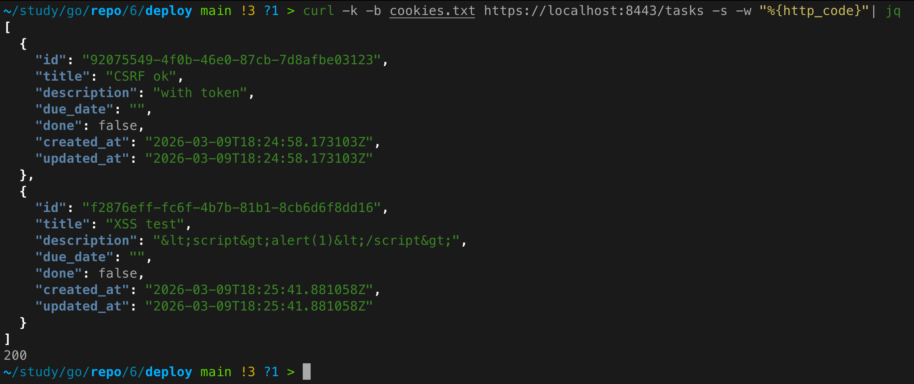
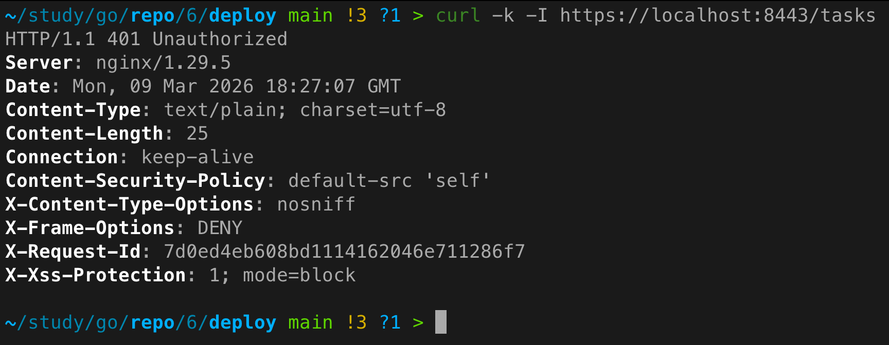

# Практическое задание 6. Реализация защиты от CSRF/XSS. Работа с secure cookies

**Студент:** Бондарь Андрей Ренатович  
**Группа:** ЭФМО-02-25

---

## Цель работы
Научиться безопасно использовать cookies в серверном приложении и внедрить практические меры защиты от CSRF и XSS.

---

## Используемые cookies и их флаги

В сервисе `auth` после успешного логина устанавливаются две cookies:

| Cookie       | Значение     | HttpOnly | Secure | SameSite | Max-Age | Назначение                              |
|--------------|--------------|----------|--------|----------|---------|-----------------------------------------|
| `session`    | demo-token   | Да       | Да     | Lax      | 3600    | Идентификатор сессии (аутентификация)   |
| `csrf_token` | UUID         | Нет      | Да     | Lax      | 3600    | Токен для защиты от CSRF (читается JS)  |

**Почему такие флаги:**
- **HttpOnly** для `session` – защита от кражи через XSS (JavaScript не может прочитать cookie).
- **Secure** – cookie передаётся только по HTTPS (обязательно для production).
- **SameSite=Lax** – предотвращает отправку cookie в кросс-сайтовых запросах, но оставляет возможность для безопасных переходов (например, GET с главного сайта).
- **csrf_token** не имеет HttpOnly, чтобы клиентский JavaScript мог прочитать его и отправить в заголовке `X-CSRF-Token`.

---

## Выбранный подход к CSRF-защите

Реализован **Double Submit Cookie**:
1. Сервер генерирует случайный токен и сохраняет его в cookie `csrf_token` (без HttpOnly).
2. Клиент читает этот токен и добавляет его в заголовок `X-CSRF-Token` для всех запросов, изменяющих состояние (POST, PATCH, DELETE).
3. На сервере middleware `CSRFProtection` сравнивает значение из cookie и заголовка. При несовпадении или отсутствии – возвращает `403 Forbidden`.

**Почему это работает:** Злоумышленник не может прочитать cookie `csrf_token` с другого домена (из-за Same-Origin Policy), а значит не сможет подставить правильный заголовок, даже если браузер автоматически отправит все cookies.

---

## Реализация в сервисах

### Auth service – выдача cookies
В хендлере `Login` после проверки учётных данных:
```go
http.SetCookie(w, &http.Cookie{
    Name:     "session",
    Value:    "demo-token",
    Path:     "/",
    HttpOnly: true,
    Secure:   true,
    SameSite: http.SameSiteLaxMode,
    MaxAge:   3600,
})

http.SetCookie(w, &http.Cookie{
    Name:     "csrf_token",
    Value:    csrfToken,
    Path:     "/",
    HttpOnly: false,
    Secure:   true,
    SameSite: http.SameSiteLaxMode,
    MaxAge:   3600,
})
```

### Tasks service – проверка аутентификации и CSRF

**Middleware `Auth`** проверяет наличие и валидность `session` cookie, обращаясь к Auth service по gRPC.

**Middleware `CSRFProtection`** для изменяющих методов:
```go
func CSRFProtection(log *logrus.Logger) func(http.Handler) http.Handler {
    return func(next http.Handler) http.Handler {
        return http.HandlerFunc(func(w http.ResponseWriter, r *http.Request) {
            if r.Method == http.MethodPost || r.Method == http.MethodPatch || r.Method == http.MethodDelete {
                csrfCookie, err := r.Cookie("csrf_token")
                if err != nil || r.Header.Get("X-CSRF-Token") != csrfCookie.Value {
                    http.Error(w, `{"error":"CSRF token invalid"}`, http.StatusForbidden)
                    return
                }
            }
            next.ServeHTTP(w, r)
        })
    }
}
```

---

## Защита от XSS

### Экранирование пользовательского ввода
В поле `description` задачи (эндпоинты `POST /tasks` и `PATCH /tasks`) применяется функция `html.EscapeString` из пакета `html`:
```go
safeDescription := html.EscapeString(req.Description)
```
Таким образом, любые HTML-теги превращаются в безопасные сущности (например, `<script>` становится `&lt;script&gt;`).

### Заголовки безопасности
Добавлено middleware `SecurityHeaders`, которое устанавливает следующие заголовки для всех ответов:
```
Content-Security-Policy: default-src 'self'
X-Content-Type-Options: nosniff
X-Frame-Options: DENY
X-XSS-Protection: 1; mode=block
```
Эти заголовки снижают риск XSS и clickjacking в браузере.

---

## Примеры запросов и проверка

### Логин и сохранение cookies
```bash
curl -k -X POST https://localhost:8443/auth/login \
  -H "Content-Type: application/json" \
  -c cookies.txt \
  -d '{"username":"student","password":"student"}'
```


### Попытка создать задачу без CSRF-токена (ожидается 403)
```bash
curl -k -X POST https://localhost:8443/tasks \
  -H "Content-Type: application/json" \
  -b cookies.txt \
  -d '{"title":"CSRF test","description":"no token"}'
```


### Создание задачи с корректным CSRF-токеном
Извлекаем значение `csrf_token` из `cookies.txt` (можно прочитать вручную или скриптом):
```bash
CSRF_TOKEN=$(grep csrf_token cookies.txt | awk '{print $7}')
curl -k -X POST https://localhost:8443/tasks \
  -H "Content-Type: application/json" \
  -H "X-CSRF-Token: $CSRF_TOKEN" \
  -b cookies.txt \
  -d '{"title":"CSRF ok","description":"with token"}'
```


### Проверка экранирования XSS
```bash
curl -k -X POST https://localhost:8443/tasks \
  -H "Content-Type: application/json" \
  -H "X-CSRF-Token: $CSRF_TOKEN" \
  -b cookies.txt \
  -d '{"title":"XSS test","description":"<script>alert(1)</script>"}'
```



Затем получение задачи через GET:
```bash
curl -k -b cookies.txt https://localhost:8443/tasks | jq .
```



В ответе поле `description` экранировано.

### Проверка заголовков безопасности
```bash
curl -k -I https://localhost:8443/tasks
```



В ответе содержатся строки:
- **`Content-Security-Policy: default-src 'self'`** — ресурсы (скрипты, стили и т.д.) загружаются только с того же домена (защита от XSS).
- **`X-Content-Type-Options: nosniff`** — запрещает браузеру угадывать MIME-тип файла (предотвращает выполнение скриптов из нетекстовых файлов).
- **`X-Frame-Options: DENY`** — страницу нельзя открывать во фрейме (защита от кликджекинга).
- **`X-XSS-Protection: 1; mode=block`** — включает фильтр XSS, который блокирует страницу при обнаружении атаки.

---

## Инструкция по запуску (с учётом HTTPS из ПЗ5)

1. Убедиться, что сертификаты сгенерированы:
   ```bash
   mkdir -p deploy/tls
   openssl req -x509 -newkey rsa:2048 -nodes -keyout deploy/tls/key.pem -out deploy/tls/cert.pem -days 365 -subj "/CN=localhost"
   ```

2. Запустить стек с PostgreSQL, сервисами auth, tasks и nginx:
   ```bash
   cd deploy
   docker-compose up -d
   ```

3. Проверить, что все контейнеры запущены:
   ```bash
   docker-compose ps
   ```

4. Выполнить проверочные запросы из раздела 6.

---

## Выводы
- Внедрены безопасные cookies с флагами HttpOnly, Secure, SameSite.
- Реализована CSRF-защита методом Double Submit Cookie.
- Для предотвращения XSS применяется экранирование пользовательского ввода и заголовки безопасности.
- Все запросы, изменяющие состояние, защищены проверкой CSRF-токена.
- Интеграция с предыдущими работами (HTTPS, PostgreSQL) сохранена.

