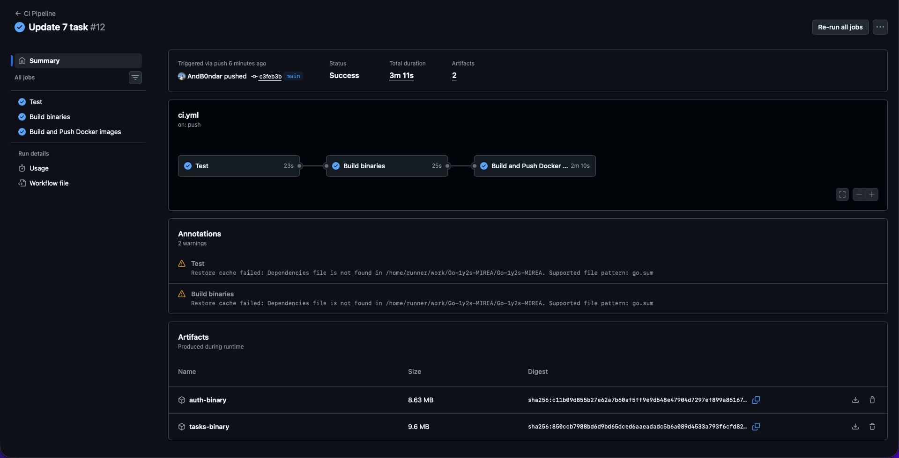

# Практическое задание 8. Настройка GitHub Actions / GitLab CI для деплоя приложения

**Студент:** Бондарь Андрей Ренатович  
**Группа:** ЭФМО-02-25

## Цель работы
Настроить автоматическую проверку качества и сборку проекта при каждом push/merge, реализовав базовый конвейер CI: тестирование, сборка, упаковка Docker-образов и публикация в registry.

---

## Файл pipeline (GitHub Actions)

**Файл:** `.github/workflows/ci.yml`

```yaml
name: CI Pipeline

on:
  push:
    branches: [ main, master ]
  pull_request:
    branches: [ main, master ]

env:
  GO_VERSION: '1.25'

jobs:
  test:
    name: Test
    runs-on: ubuntu-latest

    steps:
      - name: Checkout code
        uses: actions/checkout@v4

      - name: Determine latest practice directory
        id: latest-dir
        run: |
          dirs=$(ls -d [0-9]* 2>/dev/null | sort -n)
          if [ -z "$dirs" ]; then
            echo "No numbered directories found. Exiting."
            exit 1
          fi
          latest=$(echo "$dirs" | tail -n1)
          echo "Latest practice directory: $latest"
          echo "BASE_DIR=$latest" >> $GITHUB_ENV

      - name: Set up Go
        uses: actions/setup-go@v5
        with:
          go-version: ${{ env.GO_VERSION }}

      - name: Set up Go workspace
        working-directory: ${{ env.BASE_DIR }}
        run: |
          go work init
          go work use ./services/auth ./services/tasks ./shared

      - name: Cache Go modules
        uses: actions/cache@v4
        with:
          path: |
            ~/go/pkg/mod
            ~/.cache/go-build
          key: ${{ runner.os }}-go-${{ hashFiles(format('{0}/**/go.sum', env.BASE_DIR)) }}
          restore-keys: |
            ${{ runner.os }}-go-

      - name: Run lint for auth
        working-directory: ${{ env.BASE_DIR }}/services/auth
        run: go vet ./...

      - name: Run tests for auth
        working-directory: ${{ env.BASE_DIR }}/services/auth
        run: go test -short ./... || echo "No tests found"

      - name: Run lint for tasks
        working-directory: ${{ env.BASE_DIR }}/services/tasks
        run: go vet -short ./... || echo "No tests found"

      - name: Run tests for tasks
        working-directory: ${{ env.BASE_DIR }}/services/tasks
        run: go test -short ./... || echo "No tests found"

  build:
    name: Build binaries
    runs-on: ubuntu-latest
    needs: test

    steps:
      - name: Checkout code
        uses: actions/checkout@v4

      - name: Determine latest practice directory
        id: latest-dir
        run: |
          dirs=$(ls -d [0-9]* 2>/dev/null | sort -n)
          if [ -z "$dirs" ]; then
            echo "No numbered directories found. Exiting."
            exit 1
          fi
          latest=$(echo "$dirs" | tail -n1)
          echo "Latest practice directory: $latest"
          echo "BASE_DIR=$latest" >> $GITHUB_ENV

      - name: Set up Go
        uses: actions/setup-go@v5
        with:
          go-version: ${{ env.GO_VERSION }}

      - name: Set up Go workspace
        working-directory: ${{ env.BASE_DIR }}
        run: |
          go work init
          go work use ./services/auth ./services/tasks ./shared

      - name: Cache Go modules
        uses: actions/cache@v4
        with:
          path: |
            ~/go/pkg/mod
            ~/.cache/go-build
          key: ${{ runner.os }}-go-${{ hashFiles(format('{0}/**/go.sum', env.BASE_DIR)) }}
          restore-keys: |
            ${{ runner.os }}-go-

      - name: Build auth binary
        working-directory: ${{ env.BASE_DIR }}/services/auth
        run: go build -o auth-server ./cmd/auth

      - name: Build tasks binary
        working-directory: ${{ env.BASE_DIR }}/services/tasks
        run: go build -o tasks-server ./cmd/tasks

      - name: Upload auth binary as artifact
        uses: actions/upload-artifact@v4
        with:
          name: auth-binary
          path: ${{ env.BASE_DIR }}/services/auth/auth-server

      - name: Upload tasks binary as artifact
        uses: actions/upload-artifact@v4
        with:
          name: tasks-binary
          path: ${{ env.BASE_DIR }}/services/tasks/tasks-server

  docker:
    name: Build and Push Docker images
    runs-on: ubuntu-latest
    needs: build
    if: github.event_name == 'push' && (github.ref == 'refs/heads/main' || github.ref == 'refs/heads/master' || startsWith(github.ref, 'refs/tags/'))
    permissions:
      contents: read
      packages: write

    steps:
      - name: Checkout code
        uses: actions/checkout@v4

      - name: Determine latest practice directory
        id: latest-dir
        run: |
          dirs=$(ls -d [0-9]* 2>/dev/null | sort -n)
          if [ -z "$dirs" ]; then
            echo "No numbered directories found. Exiting."
            exit 1
          fi
          latest=$(echo "$dirs" | tail -n1)
          echo "Latest practice directory: $latest"
          echo "BASE_DIR=$latest" >> $GITHUB_ENV

      - name: Set lowercase repository name
        run: |
          echo "LOWER_REPO=${GITHUB_REPOSITORY,,}" >> $GITHUB_ENV

      - name: Set up Docker Buildx
        uses: docker/setup-buildx-action@v3

      - name: Log in to GitHub Container Registry
        uses: docker/login-action@v3
        with:
          registry: ghcr.io
          username: ${{ github.actor }}
          password: ${{ secrets.GITHUB_TOKEN }}

      - name: Generate image tags
        id: meta
        run: |
          if [[ "${{ github.ref }}" == refs/tags/* ]]; then
            VERSION=${GITHUB_REF#refs/tags/}
          else
            VERSION=$(git rev-parse --short HEAD)
          fi
          echo "version=$VERSION" >> $GITHUB_OUTPUT
          echo "tags_auth=ghcr.io/${LOWER_REPO}/auth-service:$VERSION,ghcr.io/${LOWER_REPO}/auth-service:latest" >> $GITHUB_OUTPUT
          echo "tags_tasks=ghcr.io/${LOWER_REPO}/tasks-service:$VERSION,ghcr.io/${LOWER_REPO}/tasks-service:latest" >> $GITHUB_OUTPUT

      - name: Build and push auth image
        uses: docker/build-push-action@v5
        with:
          context: ${{ env.BASE_DIR }}
          file: ${{ env.BASE_DIR }}/services/auth/Dockerfile
          push: true
          tags: ${{ steps.meta.outputs.tags_auth }}
          cache-from: type=gha
          cache-to: type=gha,mode=max

      - name: Build and push tasks image
        uses: docker/build-push-action@v5
        with:
          context: ${{ env.BASE_DIR }}
          file: ${{ env.BASE_DIR }}/services/tasks/Dockerfile
          push: true
          tags: ${{ steps.meta.outputs.tags_tasks }}
          cache-from: type=gha
          cache-to: type=gha,mode=max

```

В процессе выполнения практических работ потребуется автоматически определять номер последней выполненной практики. Ниже приведён CI/CD используется скрипт на bash, который находит максимальный номер среди директорий, имена которых начинаются с цифры, и сохраняет его в переменную окружения `BASE_DIR`.

```bash
- name: Determine latest practice directory
  id: latest-dir
  run: |
    dirs=$(ls -d [0-9]* 2>/dev/null | sort -n)
    if [ -z "$dirs" ]; then
      echo "No numbered directories found. Exiting."
      exit 1
    fi
    latest=$(echo "$dirs" | tail -n1)
    echo "Latest practice directory: $latest"
    echo "BASE_DIR=$latest" >> $GITHUB_ENV
```

---

## Описание шагов pipeline

### Job `test`
- **Checkout** – клонирование репозитория.
- **Set up Go** – установка Go версии 1.21.
- **Cache Go modules** – кеширование зависимостей для ускорения последующих запусков.
- **Run tests** – запуск `go test` в обоих сервисах (auth и tasks), проверка корректности тестов.
- **Build binary** – пробная компиляция (без сохранения бинарника) для проверки, что код собирается без ошибок.

### Job `docker`
- Запускается только после успешного прохождения `test` и только при push в ветку `main` или при создании тега.
- **Login to GHCR** – аутентификация в GitHub Container Registry с использованием встроенного `GITHUB_TOKEN`.
- **Generate tags** – определение версии для образов:
  - Если push по тегу (например, `v1.2.3`), используется имя тега.
  - Если push в `main`, используется короткий хеш коммита.
  - Для обоих случаев добавляется тег `latest`.
- **Build and push** – multi-stage сборка Docker-образов для `auth` и `tasks` с использованием кеширования (GitHub Actions cache). Образы публикуются в GHCR.

---

## Скриншот успешного прогона



На скриншоте видны синие статусы jobs `test` и `docker`.

Полученные Docker-образов можно получить по ссылке *https://github.com/AndB0ndar?tab=packages&repo_name=Go-1y2s-MIREA*.

---

## Версионирование Docker-образов

Образы тегируются следующим образом:
- Для коммитов в ветку `main`: `{короткий SHA коммита}` и `latest`.
- Для git-тегов: `{имя тега}` и `latest`.

Примеры:
- `ghcr.io/username/tasks-service:abc1234`
- `ghcr.io/username/tasks-service:latest`
- `ghcr.io/username/auth-service:v1.2.3`

Это позволяет однозначно связать образ с исходным кодом и легко откатиться при необходимости.

---

## Используемые секреты

В pipeline используется только автоматически генерируемый `GITHUB_TOKEN` с правами `packages: write`. Никаких дополнительных секретов не требуется, так как публикация идёт во встроенный GitHub Container Registry.

Если бы потребовался внешний registry (например, Docker Hub), были бы добавлены секреты `DOCKER_USERNAME` и `DOCKER_PASSWORD`, хранящиеся в настройках репозитория (Settings -> Secrets and variables).

---

## Выводы
- Настроен полный CI-пайплайн для двух сервисов (auth и tasks) на GitHub Actions.
- Пайплайн включает тестирование, пробную сборку, сборку Docker-образов и публикацию в GitHub Container Registry.
- Используется версионирование образов на основе хеша коммита или git-тега.
- Обеспечена безопасность: секреты не хранятся в коде, используется встроенный токен с минимальными правами.

