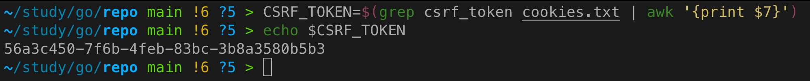
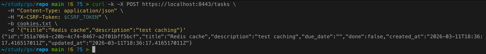
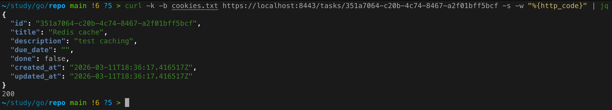
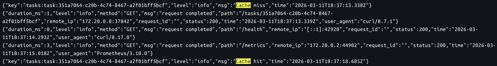
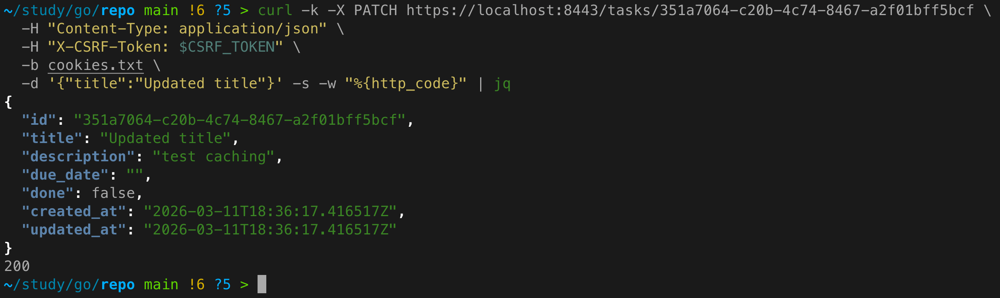
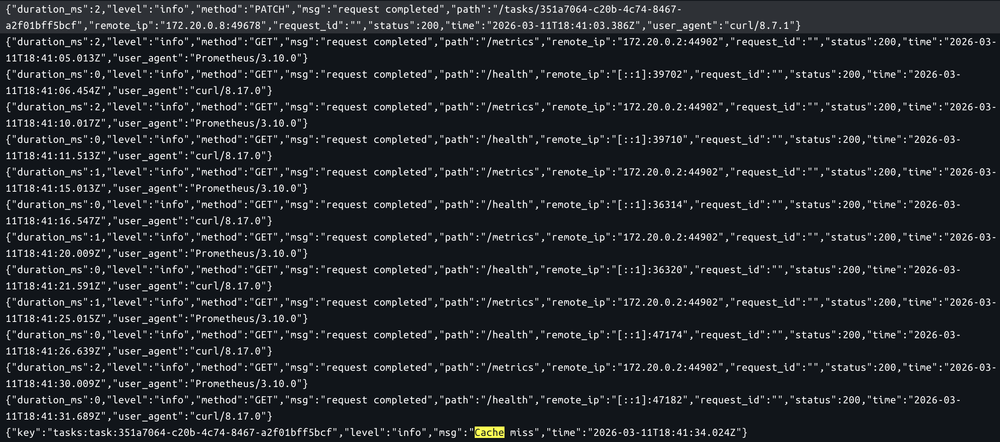
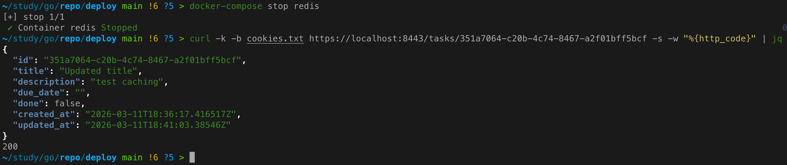
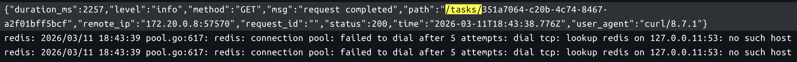

# Практическое задание 9. Реализация распределённого кэша (Redis cluster)

**Студент:** Бондарь Андрей Ренатович  
**Группа:** ЭФМО-02-25

---

## Цель работы
Освоить внедрение распределённого кэша как отдельной инфраструктурной зависимости и реализовать стратегию cache-aside с корректным TTL и поведением при сбоях Redis.

---

## Используемые ключи кэша и их формирование
Для кэширования отдельных задач используется ключ формата:
```
tasks:task:{id}
```
где `{id}` – уникальный идентификатор задачи (например, `t_001` или UUID).

Для списка задач кэширование не реализовано (оставлено на усмотрение, в данной работе фокус на чтение по ID).

---

## Стратегия cache-aside (алгоритм)
Для эндпоинта `GET /tasks/{id}` реализован следующий алгоритм:

1. Сформировать ключ `tasks:task:{id}`.
2. Попытаться прочитать данные из Redis по этому ключу.
   - Если данные найдены (hit): десериализовать JSON и вернуть задачу.
   - Если данные не найдены (miss) или произошла ошибка Redis: перейти к шагу 3.
3. Запросить задачу из базы данных (через репозиторий).
4. Если задача найдена в БД:
   - Сериализовать в JSON и сохранить в Redis с TTL + jitter.
   - Вернуть задачу клиенту.
5. Если задача не найдена в БД – вернуть `404 Not Found`.

Это классическая реализация cache-aside (lazy caching), где кэш заполняется только при чтении.

---

## TTL и jitter

### TTL (Time To Live)
Для кэшированных задач установлен базовый TTL = **120 секунд**. Это значение выбрано как компромисс между актуальностью данных и снижением нагрузки на БД.

### Jitter (случайный разброс)
Чтобы избежать эффекта **cache avalanche** (одновременное истечение множества ключей и лавина запросов в БД), к базовому TTL добавляется случайное значение от 0 до **30 секунд**. Таким образом, фактическое время жизни ключа варьируется от 120 до 150 секунд.

Jitter реализован с помощью `rand.Intn(jitterSeconds)` при сохранении в кэш.

---

## Инвалидация кэша при изменениях
При модификации данных кэш инвалидируется (удаляется), чтобы избежать устаревания:

- **PATCH /tasks/{id}** – после успешного обновления задачи в БД удаляется ключ `tasks:task:{id}`.
- **DELETE /tasks/{id}** – после удаления задачи из БД удаляется соответствующий ключ.
- **POST /tasks** – при создании новой задачи инвалидация не требуется, так как ключа для нового ID ещё нет.

Инвалидация выполняется асинхронно (в отдельной горутине), чтобы не задерживать ответ клиента. При ошибках удаления ключа они только логируются, но не влияют на основной ответ.

---

## Деградация при недоступности Redis
Сервис спроектирован таким образом, что Redis не является критической зависимостью:

- При **старте** сервиса, если подключение к Redis не удаётся (например, Redis не запущен), клиент Redis не создаётся, и сервис продолжает работать без кэша (все запросы идут напрямую в БД). В логах выводится предупреждение.
- В процессе работы, если Redis становится недоступен (например, остановлен), операции чтения из кэша возвращают ошибку, которая логируется и интерпретируется как miss – запрос идёт в БД. Операции записи в кэш также логируют ошибку, но не влияют на основной поток.

Таким образом, сервис всегда остаётся доступным, даже при полной недоступности Redis.

---

## Запуск Redis и интеграция с docker-compose

### Добавление Redis в общий compose-файл
В `deploy/docker-compose.yml` добавлен сервис `redis`:

```yaml
redis:
  image: redis:7-alpine
  container_name: redis
  ports:
    - "6379:6379"
  networks:
    - app-network
  command: redis-server --appendonly yes
```

### Переменные окружения для сервиса `tasks`
В секцию `environment` сервиса `tasks` добавлены:

```yaml
- REDIS_ADDR=redis:6379
- REDIS_PASSWORD=
- CACHE_TTL_SECONDS=120
- CACHE_TTL_JITTER_SECONDS=30
```

### Запуск стенда
```bash
cd deploy
docker-compose up -d
```

Проверка, что Redis запущен:
```bash
docker-compose ps redis
```

---

## Проверка работы (примеры запросов)

Для начала получим csrf_token:



### Создание задачи
```bash
curl -k -X POST https://localhost:8443/tasks \
  -H "Content-Type: application/json" \
  -H "X-CSRF-Token: $CSRF_TOKEN" \
  -b cookies.txt \
  -d '{"title":"Redis cache","description":"test caching"}'
```



### Получение по запросу

Первый запрос (miss):
```bash
curl -k -b cookies.txt https://localhost:8443/tasks/t_001
```

Второй запрос (hit):
```bash
curl -k -b cookies.txt https://localhost:8443/tasks/t_001
```
Задача возвращается из кэша.





### Обновление задачи и инвалидация
```bash
curl -k -X PATCH https://localhost:8443/tasks/t_001 \
  -H "Content-Type: application/json" \
  -H "X-CSRF-Token: $CSRF_TOKEN" \
  -b cookies.txt \
  -d '{"title":"Updated title"}'
```



После этого запрос на чтение снова приведёт к miss, так как ключ был удалён.



### Симуляция недоступности Redis
Остановим Redis:
```bash
docker-compose stop redis
```
Выполним запрос на чтение задачи:
```bash
curl -k -b cookies.txt https://localhost:8443/tasks/t_001
```



---

## Выводы
- В сервис `tasks` добавлен кэш на базе Redis с использованием стратегии cache-aside.
- Реализован TTL с jitter для предотвращения cache avalanche.
- При обновлении/удалении задач кэш инвалидируется.
- Обеспечена деградация: при недоступности Redis сервис продолжает работать через БД.
- Интеграция выполнена через docker-compose, конфигурация задаётся переменными окружения.

